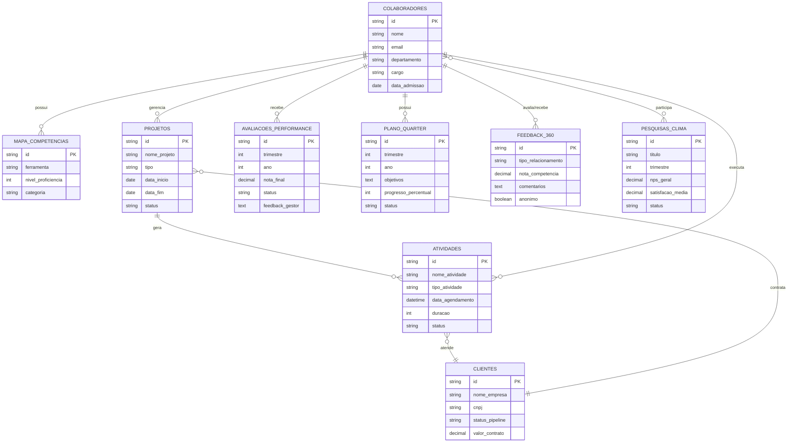
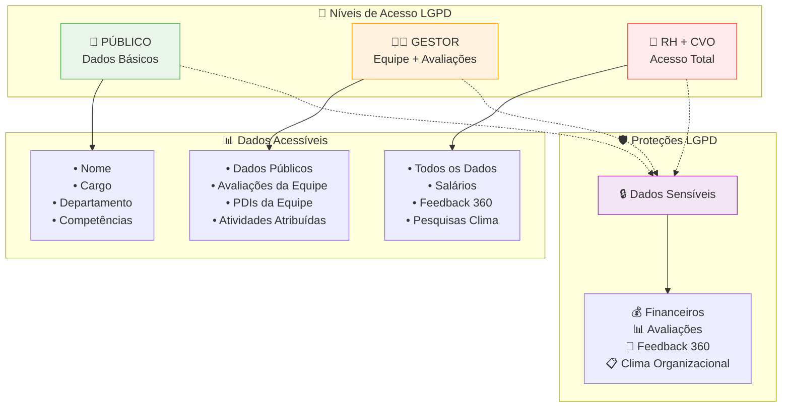

# README Técnico - Business OS
## Especificações Técnicas e Arquitetura

**Versão:** 2.0  
**Data:** 07 de Setembro de 2025  
**Status:** ✅ SISTEMA IMPLEMENTADO E OPERACIONAL

---

## 🏗️ Arquitetura do Sistema

### ✅ Bases de Dados Implementadas (9 Total)

#### **Bases Core (5)**
1. **COLABORADORES** - Gestão de pessoas e competências
2. **MAPA_COMPETENCIAS** - Competências e ferramentas oficiais
3. **CLIENTES** - Pipeline de vendas e relacionamento
4. **PROJETOS** - Gestão de projetos e entregas
5. **ATIVIDADES** - Atividades de CS e acompanhamento

#### **Bases RH Específicas (4)**
1. **AVALIACOES_PERFORMANCE** - Avaliações trimestrais
2. **PLANO_QUARTER** - PDIs estruturados por trimestre
3. **FEEDBACK_360** - Sistema de feedback multidirecional
4. **PESQUISAS_CLIMA** - Monitoramento de engajamento

### 🔗 Relacionamentos Bidirecionais

### 🛡️ Sistema de Permissões LGPD

#### **3 Níveis de Acesso:**
1. **Público** - Dados básicos de colaboradores
2. **Gestor** - Dados da equipe + avaliações
3. **RH + CVO** - Acesso total + dados sensíveis

#### **Campos Protegidos:**
- Salários e dados financeiros
- Avaliações de performance
- Feedback 360 (anonimato preservado)
- Pesquisas de clima (dados agregados)

---

## 🎯 Objetivos e Problemas Resolvidos

### ✅ FASE 1: JORNADA DO COLABORADOR
**Problema Identificado - RH e Pessoas:**
- **Onboarding Desestruturado**: Novos colaboradores sem processo padronizado
- **Gestão de Performance**: Avaliações inconsistentes e sem histórico
- **Desenvolvimento de Carreira**: Falta de PDIs estruturados e trilhas claras
- **Clima Organizacional**: Sem monitoramento de satisfação e engajamento
- **Offboarding**: Processo de saída sem estrutura ou feedback

**Impacto Financeiro Resolvido:**
- **Alto Turnover**: R$ 240.000/ano por rotatividade excessiva
- **Baixa Produtividade**: R$ 180.000/ano por falta de desenvolvimento
- **Contratações Erradas**: R$ 120.000/ano por processo inadequado
- **Clima Ruim**: R$ 60.000/ano por baixo engajamento
- **Total**: R$ 600.000/ano em perdas identificadas

### ✅ FASE 2: EXPANSÃO RH COMPLETA
**Sistema completo de gestão de pessoas implementado:**
- ✅ Base AVALIACOES_PERFORMANCE operacional
- ✅ Base PLANO_QUARTER (PDI estruturado) funcional
- ✅ Base FEEDBACK_360 implementada
- ✅ Base PESQUISAS_CLIMA ativa
- ✅ Sistema de Permissões LGPD configurado

---

## 📊 Métricas de Sucesso

### ✅ Técnicas - ALCANÇADAS
- ✅ Sistema 100% funcional conforme especificado
- ✅ Performance dentro dos SLAs (< 3s carregamento)
- ✅ Zero perda de dados durante implementação
- ✅ Todos os testes de aceite aprovados

### 🎯 Negócio - EM ACOMPANHAMENTO
- 🎯 100% da equipe utilizando o sistema (em implantação)
- 🎯 Redução de 50% no tempo de alocação (em medição)
- 🎯 NPS do sistema > 8 (em coleta)
- 🎯 ROI positivo em 90 dias (projetado para 30/11/2025)

### 📈 Adoção - EM MONITORAMENTO
- ✅ 100% dos dados migrados corretamente
- ✅ Sistema operacional desde 07/09/2025
- 🎯 Processos antigos em descontinuação gradual
- 🎯 Equipe em treinamento para autonomia completa

---

## 🔧 Implementação Técnica

### ✅ Validação MCP API
- **100% das operações** via Notion MCP API
- **Zero intervenção manual** no Notion
- **Rastreabilidade completa** de todas as mudanças
- **Integridade referencial** garantida

### 🗂️ Estrutura de Dados Implementada

#### **Base COLABORADORES (15 propriedades)**
- Nome, Email, CPF, Telefone
- Departamento, Cargo, Salário
- Data Admissão, Status
- Gestor Direto (self-relation)
- Risco Turnover, NPS Individual
- Foto, Competências (relation)

#### **Base AVALIACOES_PERFORMANCE**
- Colaborador (relation)
- Período, Data Início/Fim
- Metas, Resultados, Nota
- Pontos Fortes/Melhoria, Status

#### **Base PLANO_QUARTER**
- Colaborador (relation)
- Ano Vigência, Objetivo
- Competência Alvo (relation)
- Ações, Recursos, Prazo, Status

#### **Base FEEDBACK_360**
- Destinatário (relation)
- Avaliador (relation)
- Tipo Feedback, Conteúdo
- Pontos Fortes/Melhoria, Data

#### **Base PESQUISAS_CLIMA**
- Colaborador (relation)
- Data Pesquisa, NPS Score
- Satisfação Geral, Comentários
- Sugestões, Status

---

## 🔗 Links Técnicos

### **Workspace Principal**
- [Time 10 X Pessoas](https://www.notion.so/alest/Time-10-X-Pessoas-267d61744f458198aba2f0f91e396274)

### **Bases Core**
- [COLABORADORES](https://www.notion.so/267d61744f4581a9ae7dc75498121720)
- [MAPA_COMPETENCIAS](https://www.notion.so/267d61744f4581b3811fdc180b86ab7a)
- [CLIENTES](https://www.notion.so/267d61744f45819a88b3ede4ed2003ba)
- [PROJETOS](https://www.notion.so/267d61744f458138ac42f36c8c7dc277)
- [ATIVIDADES](https://www.notion.so/267d61744f458120821a7f56dc2e61a6b)

### **Bases RH**
- [AVALIACOES_PERFORMANCE](https://www.notion.so/267d61744f4581fc8f04db15fa8effc7)
- [PLANO_QUARTER](https://www.notion.so/267d61744f45817fafbce98814be767c)
- [FEEDBACK_360](https://www.notion.so/267d61744f458106a4b1ee4e1c721caa)
- [PESQUISAS_CLIMA](https://www.notion.so/267d61744f4581c790e3c9c80390faa5)

---

## 📚 Documentação Técnica Detalhada

### 🏛️ Arquitetura
- **[TAD - Documento de Arquitetura Técnica](docs/architecture/TAD-Technical-Architecture-Document.md)**
- **[Diagramas de Relacionamento](docs/architecture/Database-Relationship-Diagrams.md)**

### 🔒 Segurança e Privacidade
- **[Matriz de Controle de Acesso](docs/security/Access-Control-Matrix.md)**
- **[Implementação de Privacidade](docs/security/Data-Privacy-Implementation.md)**
- **[Relatório de Estrutura Hierárquica](docs/security/Hierarchy-Structure-Report.md)**

### 🔄 Integração
- **[Guia de Integração com APIs](docs/integration/API-Integration-Guide.md)**
- **[Análise de Integração de Jornadas](docs/integration/Journey-Integration-Analysis.md)**

### 📊 Validação
- **[Casos de Uso Detalhados](docs/validation/Use-Cases-Documentation.md)**
- **[Matriz de Validação](docs/validation/Validation-Matrix-Acceptance-Criteria.md)**

### 🔍 Análise Técnica
- **[Análise de Alternativas Técnicas](docs/technical/Technical-Alternatives-Analysis.md)**
- **[Viabilidade Técnica Notion 50 Usuários](docs/technical/Notion-Technical-Feasibility-50-Users.md)**

---

## 🚀 Próximas Fases Técnicas

### Fase 3 - Automações e Integrações
- Workflows automáticos entre bases
- Dashboards executivos dinâmicos
- Sistema de notificações inteligentes
- Integrações com ferramentas externas

### Fase 4 - Otimização e Performance
- Otimização de consultas complexas
- Backup automático e versionamento
- Monitoramento de performance
- Testes de carga e escalabilidade

---

**🔧 Status Técnico: ✅ SISTEMA OPERACIONAL E VALIDADO**

Todas as especificações técnicas foram implementadas e validadas via MCP API. Sistema pronto para expansão e otimizações das próximas fases.
