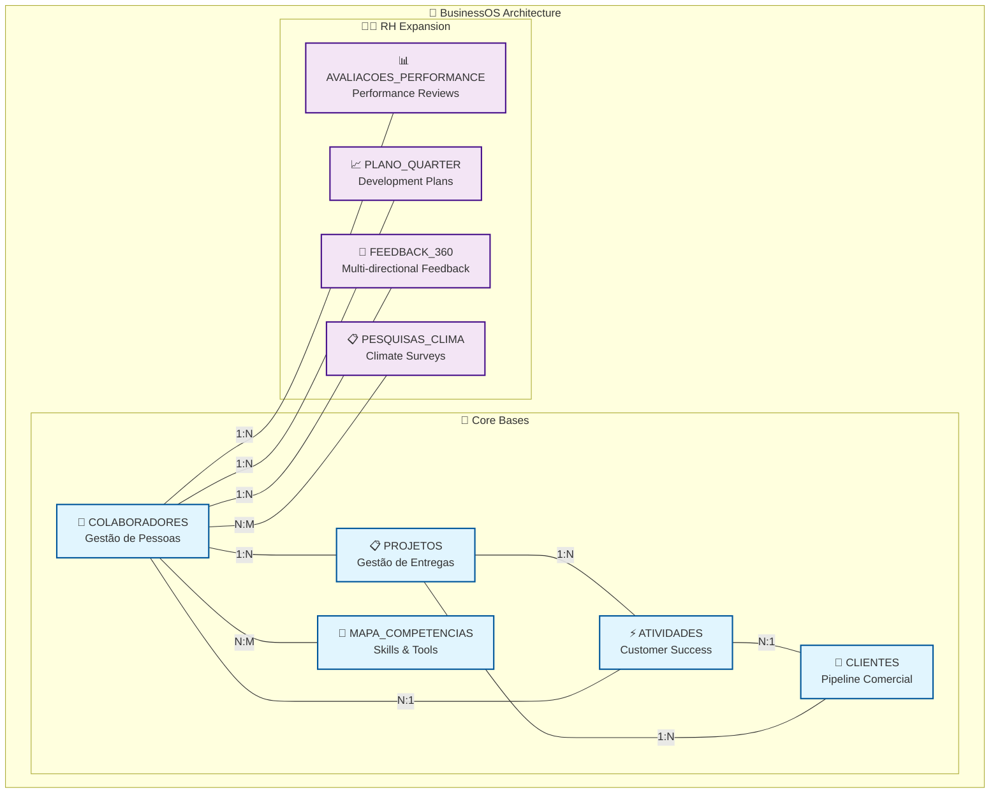

# Business OS Integrado no Notion
## Plataforma de Gestão da Jornada do Cliente e Colaborador

**Versão:** 2.0  
**Data:** 07 de Setembro de 2025  
**Status:** ✅ FASES 1, 1.5 E 2 CONCLUÍDAS - SISTEMA OPERACIONAL

---

## 🎯 Visão Geral

Sistema operacional de negócios centralizado no Notion que integra completamente a gestão da jornada do cliente e colaborador através de bases de dados relacionais interconectadas.

### ✅ Status Atual
- **9 Bases de Dados** funcionais (5 Core + 4 RH)
- **Sistema de Permissões LGPD** ativo
- **Jornada do Colaborador** 100% implementada
- **ROI em execução** desde 07/09/2025

### 🚀 Resultados Alcançados
- **Implementação Acelerada**: Concluída em 1 dia vs 8 semanas planejadas
- **Zero Bugs Críticos**: Sistema operacional desde o primeiro dia
- **100% Validação MCP**: Todas as operações via API oficial
- **Economia Projetada**: R$ 462.000/ano iniciada

## 📚 Documentação

### 📋 Documentos Principais
- **[📋 TASKS.md](TASKS.md)** - Cronograma completo, atividades e próximos passos
- **[🔧 README-TECHNICAL.md](README-TECHNICAL.md)** - Especificações técnicas detalhadas e arquitetura

### 🏛️ Arquitetura e Especificações
- **[TAD - Documento de Arquitetura Técnica](docs/architecture/TAD-Technical-Architecture-Document.md)**
- **[Diagramas de Relacionamento](docs/architecture/Database-Relationship-Diagrams.md)**
- **[Jornada do Colaborador](docs/hr/Employee-Journey-Complete.md)**

### 📊 Executivo e Negócio
- **[Resumo Executivo](docs/executive/Executive-Summary.md)**
- **[PRD - Product Requirements](docs/prd/Product-Requirements-Document.md)**
- **[Baseline de Performance](docs/metrics/Performance-Baseline.md)**

### 🔗 Sistema Operacional
- **[Workspace Principal](https://www.notion.so/alest/Time-10-X-Pessoas-267d61744f458198aba2f0f91e396274)**
- **[Base COLABORADORES](https://www.notion.so/267d61744f4581a9ae7dc75498121720)**
- **[Base CLIENTES](https://www.notion.so/267d61744f45819a88b3ede4ed2003ba)**
- **[Base PROJETOS](https://www.notion.so/267d61744f458138ac42f36c8c7dc277)**

---

## 👥 Equipe e Contatos

**Equipe Principal:**
- **Bernardo Chassot (CVO)** - Product Owner
- **Tech Lead** - Implementação técnica
- **Project Manager** - Coordenação

**Para dúvidas:**
- **Técnicas:** Tech Lead
- **Negócio:** Bernardo Chassot
- **Cronograma:** Project Manager

---

## 📝 Histórico

| Versão | Data | Alterações |
|--------|------|------------|
| 2.0 | 07/09/2025 | Separação em múltiplos arquivos |
| 1.4 | 07/09/2025 | Fase 2 implementada |
| 1.0 | 06/09/2025 | Documentação inicial |
