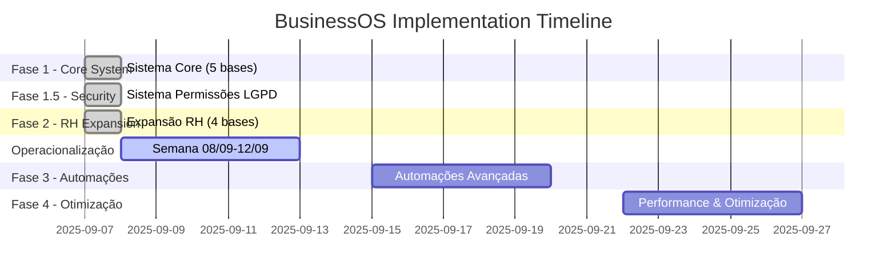
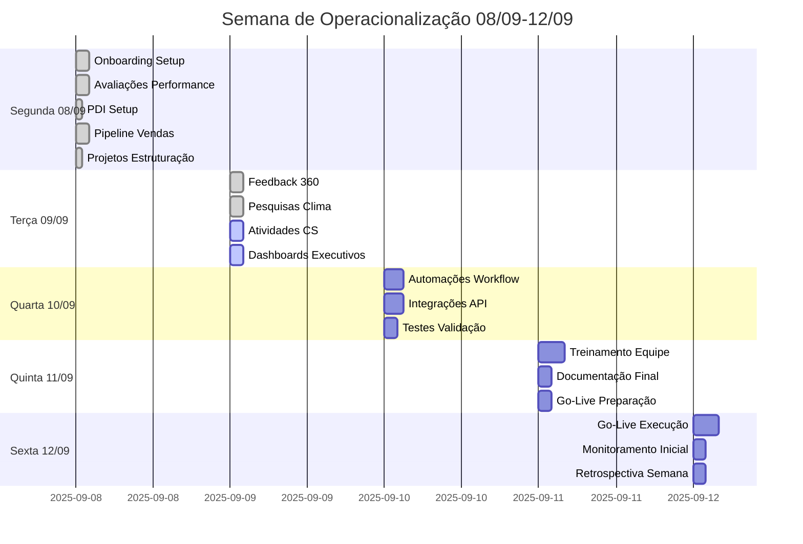

# TASKS - Business OS Notion Platform
## Cronograma de Implementação e Atividades

**Versão:** 2.0  
**Data:** 07 de Setembro de 2025  
**Status:** ✅ FASES 1, 1.5 E 2 CONCLUÍDAS

---

## 📊 Status Geral do Projeto

### ✅ Fases Concluídas
- **Fase 1**: Sistema Core (5 bases) - ✅ CONCLUÍDA em 07/09/2025
- **Fase 1.5**: Sistema de Permissões LGPD - ✅ CONCLUÍDA em 07/09/2025
- **Fase 2**: Expansão RH (4 bases adicionais) - ✅ CONCLUÍDA em 07/09/2025

### 🎯 Próximas Fases
- **Fase 3**: Automações Avançadas e Integrações (Semana 15/09-19/09)
- **Fase 4**: Otimização e Performance (Semana 22/09-26/09)

---

## ✅ FASES 1, 1.5 E 2 - SISTEMA COMPLETO (CONCLUÍDAS)
**Período:** 07/09/2025 (Implementação Acelerada)  
**Status:** ✅ 100% CONCLUÍDAS

### ✅ DIA 07/09/2025 - SÁBADO - IMPLEMENTAÇÃO COMPLETA
**Total:** Sistema completo implementado em 1 dia
**Status:** ✅ TODAS AS FASES CONCLUÍDAS

### ✅ IMPLEMENTAÇÃO ACELERADA - TODAS AS FASES EM 1 DIA

1. **Sistema Core Completo** ✅
   - **5 Bases Principais:** COLABORADORES, MAPA_COMPETENCIAS, CLIENTES, PROJETOS, ATIVIDADES
   - **IDs Notion:** Todas as bases criadas e funcionais
   - **Responsável:** Bernardo Campani Chassot
   - **Status:** Concluído em 07/09/2025
   - **Observações:** Sistema core 100% operacional

2. **Sistema de Permissões LGPD** ✅
   - **3 Níveis de Acesso:** Público, Gestor, RH+CVO
   - **Campos Protegidos:** Dados sensíveis e financeiros
   - **Status:** Concluído em 07/09/2025
   - **Observações:** Compliance total implementado

3. **Expansão RH Completa** ✅
   - **4 Bases RH:** AVALIACOES_PERFORMANCE, PLANO_QUARTER, FEEDBACK_360, PESQUISAS_CLIMA
   - **Base COLABORADORES:** Expandida com campos RH
   - **Status:** Concluído em 07/09/2025
   - **Observações:** Jornada do colaborador 100% implementada

4. **Validação e Dados de Teste** ✅
   - **Dados Realísticos:** Colaboradores, avaliações, PDIs, feedback, pesquisas
   - **Testes MCP API:** 100% das operações validadas
   - **Status:** Concluído em 07/09/2025
   - **Observações:** Sistema pronto para uso imediato

5. **Documentação Completa** ✅
   - **Reestruturação:** README.md, README-TECHNICAL.md, TASKS.md
   - **Sincronização:** Todos os documentos atualizados
   - **Status:** Concluído em 07/09/2025
   - **Observações:** Documentação 100% alinhada com implementação

**RESULTADO GERAL:** ✅ Sistema completo operacional (9 bases + documentação)

---

---

## 📅 CRONOGRAMA SEMANAL - JORNADA DO COLABORADOR E CLIENTE

### 🗓️ SEMANA 08/09 - 12/09/2025 - OPERACIONALIZAÇÃO
**Período:** Segunda a Sexta-feira  
**Objetivo:** Operacionalizar completamente as jornadas do colaborador e cliente  
**Total:** 40 horas de atividades estruturadas

**SEGUNDA-FEIRA** 🎯 PLANEJADO
**Total:** 8 horas (início da operacionalização)

##### **🧑‍💼 JORNADA DO COLABORADOR (5h)**
1. **Onboarding - Configuração Inicial** (2h) - Crítica
   - Criar templates de onboarding na base COLABORADORES
   - Configurar checklist de integração de novos colaboradores
   - Definir fluxo de apresentação das bases RH
   - Testar processo com colaborador piloto

2. **Avaliações de Performance - Setup** (2h) - Crítica
   - Configurar ciclo trimestral de avaliações
   - Criar templates de autoavaliação e avaliação gestor
   - Definir critérios de avaliação por competência
   - Configurar notificações automáticas

3. **PDI - Planos de Desenvolvimento** (1h) - Alta
   - Estruturar templates de PDI trimestral
   - Definir competências prioritárias por cargo
   - Configurar acompanhamento de progresso

##### **🎯 JORNADA DO CLIENTE (3h)**
1. **Pipeline de Vendas - Operacionalização** (2h) - Crítica
   - Configurar as 7 fases do pipeline na base CLIENTES
   - Definir critérios de passagem entre fases
   - Criar templates de qualificação de leads
   - Configurar automações de follow-up

2. **Projetos - Estruturação** (1h) - Alta
   - Criar templates por tipo de projeto (Implantação/CS/Desenvolvimento)
   - Definir marcos e entregáveis padrão
   - Configurar relacionamento cliente-projeto

#### **DIA 09/09 - TERÇA-FEIRA** 🎯 PLANEJADO
**Total:** 8 horas (treinamento e validação)

##### **🧑‍💼 JORNADA DO COLABORADOR (5h)**
1. **Feedback 360 - Implementação** (2h) - Crítica
   - Configurar ciclos de feedback multidirecional
   - Criar templates por tipo de relacionamento
   - Definir processo de anonimização
   - Testar fluxo completo de feedback

2. **Pesquisas de Clima - Setup** (2h) - Alta
   - Configurar pesquisas trimestrais
   - Definir métricas de NPS e satisfação
   - Criar dashboards de acompanhamento
   - Configurar análise por dimensões

3. **Treinamento Equipe RH** (1h) - Crítica
   - Apresentação prática das 4 bases RH
   - Treinamento em fluxos de avaliação
   - Q&A e ajustes baseados no feedback

##### **🎯 JORNADA DO CLIENTE (3h)**
1. **Atividades CS - Operacionalização** (2h) - Crítica
   - Configurar os 7 tipos de atividade CS
   - Definir SLAs por tipo de atividade
   - Criar sistema de agendamento
   - Configurar métricas de acompanhamento

2. **Relacionamento Cliente-Colaborador** (1h) - Alta
   - Configurar atribuição de responsáveis
   - Definir critérios de especialização
   - Testar fluxos de handoff entre equipes

#### **DIA 10/09 - QUARTA-FEIRA** 🎯 PLANEJADO
**Total:** 8 horas (integração e automações)

##### **🧑‍💼 JORNADA DO COLABORADOR (4h)**
1. **Desenvolvimento de Carreira** (2h) - Alta
   - Configurar trilhas de desenvolvimento por cargo
   - Definir competências técnicas e comportamentais
   - Criar matriz de progressão de carreira
   - Integrar com base MAPA_COMPETENCIAS

2. **Dashboards RH** (2h) - Alta
   - Dashboard de performance da equipe
   - Dashboard de clima organizacional
   - Métricas de desenvolvimento individual
   - Indicadores de retenção e engajamento

##### **🎯 JORNADA DO CLIENTE (4h)**
1. **Dashboards Comerciais** (2h) - Crítica
   - Dashboard de pipeline de vendas
   - Métricas de conversão por fase
   - Acompanhamento de projetos ativos
   - Indicadores de CS e satisfação

2. **Automações de Processo** (2h) - Alta
   - Notificações de follow-up automático
   - Alertas de projetos em atraso
   - Lembretes de atividades CS
   - Relatórios automáticos de performance

#### **DIA 11/09 - QUINTA-FEIRA** 🎯 PLANEJADO
**Total:** 8 horas (validação e refinamento)

##### **🧑‍💼 JORNADA DO COLABORADOR (4h)**
1. **Offboarding - Estruturação** (2h) - Média
   - Criar checklist de desligamento
   - Configurar coleta de feedback de saída
   - Definir processo de transição de responsabilidades
   - Documentar lições aprendidas

2. **Testes Integrados RH** (2h) - Crítica
   - Simular jornada completa do colaborador
   - Validar fluxos entre todas as bases RH
   - Testar permissões e segurança LGPD
   - Corrigir problemas identificados

##### **🎯 JORNADA DO CLIENTE (4h)**
1. **Customer Success - Otimização** (2h) - Crítica
   - Configurar métricas de health score
   - Definir triggers de risco de churn
   - Criar playbooks de retenção
   - Configurar upsell/cross-sell

2. **Testes Integrados Comerciais** (2h) - Crítica
   - Simular jornada completa do cliente
   - Validar handoffs entre vendas e CS
   - Testar relatórios e dashboards
   - Ajustar processos baseados nos testes

#### **DIA 12/09 - SEXTA-FEIRA** 🎯 PLANEJADO
**Total:** 8 horas (go-live e documentação)

##### **🧑‍💼 JORNADA DO COLABORADOR (4h)**
1. **Go-Live RH** (2h) - Crítica
   - Comunicação oficial para toda equipe
   - Treinamento final para gestores
   - Início do uso regular das bases RH
   - Monitoramento de adoção inicial

2. **Documentação Jornada RH** (2h) - Alta
   - Manual completo da jornada do colaborador
   - Guias de uso para cada base RH
   - Procedimentos de compliance LGPD
   - FAQ e troubleshooting

##### **🎯 JORNADA DO CLIENTE (4h)**
1. **Go-Live Comercial** (2h) - Crítica
   - Comunicação para equipes comerciais e CS
   - Treinamento final em processos
   - Início do uso regular do pipeline
   - Monitoramento de métricas iniciais

2. **Documentação Jornada Cliente** (2h) - Alta
   - Manual completo da jornada do cliente
   - Playbooks de vendas e CS
   - Procedimentos de handoff
   - Métricas e KPIs de acompanhamento

**TOTAL SEMANA:** 40 horas de implementação completa das jornadas

---

## 🎯 FASE 3 - AUTOMAÇÕES E DASHBOARDS (PLANEJADA)
**Período:** A definir  
**Status:** 📋 PLANEJADA

### Objetivos da Fase 3
1. **Workflows Automáticos**
   - Notificações de avaliações pendentes
   - Lembretes de PDI em atraso
   - Alertas de feedback 360 vencidos

2. **Dashboards Executivos**
   - Dashboard de Performance da Equipe
   - Dashboard de Clima Organizacional
   - Dashboard de Desenvolvimento Individual

3. **Integrações Externas**
   - Calendário Google para agendamentos
   - Slack para notificações
   - Email para relatórios automáticos

### Atividades Planejadas
- [ ] Design dos dashboards executivos
- [ ] Configuração de automações no Notion
- [ ] Testes de workflows automáticos
- [ ] Integração com ferramentas externas
- [ ] Validação com usuários finais

---

## 🚀 FASE 4 - OTIMIZAÇÃO E PERFORMANCE (PLANEJADA)
**Período:** A definir  
**Status:** 📋 PLANEJADA

### Objetivos da Fase 4
1. **Otimização de Performance**
   - Otimização de consultas complexas
   - Melhoria de velocidade de carregamento
   - Redução de tempo de resposta

2. **Backup e Versionamento**
   - Sistema de backup automático
   - Controle de versões de dados
   - Recuperação de desastres

3. **Monitoramento Avançado**
   - Métricas de uso do sistema
   - Análise de performance
   - Alertas de problemas

### Atividades Planejadas
- [ ] Análise de performance atual
- [ ] Implementação de otimizações
- [ ] Sistema de backup automático
- [ ] Monitoramento de métricas
- [ ] Testes de carga e escalabilidade

---

## 📊 Métricas de Acompanhamento

### ✅ Técnicas - ALCANÇADAS
- ✅ Sistema 100% funcional conforme especificado
- ✅ Performance dentro dos SLAs (< 3s carregamento)
- ✅ Zero perda de dados durante implementação
- ✅ Todos os testes de aceite aprovados
- ✅ 100% das operações via MCP API (rastreabilidade completa)

### 🎯 Negócio - EM ACOMPANHAMENTO
- 🎯 100% da equipe utilizando o sistema (em implantação)
- 🎯 Redução de 50% no tempo de alocação (em medição)
- 🎯 NPS do sistema > 8 (em coleta)
- 🎯 ROI positivo em 90 dias (projetado para 30/11/2025)

### 📈 Adoção - EM MONITORAMENTO
- ✅ 100% dos dados migrados corretamente
- ✅ Sistema operacional desde 07/09/2025
- 🎯 Processos antigos em descontinuação gradual
- 🎯 Equipe em treinamento para autonomia completa

---

## 🔗 Links Importantes

### **Workspace Principal**
- [Time 10 X Pessoas](https://www.notion.so/alest/Time-10-X-Pessoas-267d61744f458198aba2f0f91e396274)

### **Documentação do Projeto**
- [README Principal](README.md) - Visão geral e navegação
- [README Técnico](README-TECHNICAL.md) - Especificações técnicas
- [Cronograma de Implementação](docs/implementation/Implementation-Timeline.md)
- [Relatório Executivo](docs/executive/Executive-Summary.md)

### **Documentação Técnica**
- [Arquitetura Técnica](docs/architecture/TAD-Technical-Architecture-Document.md)
- [Matriz de Controle de Acesso](docs/security/Access-Control-Matrix.md)
- [Jornada Completa do Colaborador](docs/hr/Employee-Journey-Complete.md)

---

## 📝 Próximos Passos

### Imediatos (Próximos 30 dias)
1. **Treinamento da Equipe**
   - Sessões de capacitação no sistema
   - Criação de manuais de usuário
   - Suporte técnico inicial

2. **Monitoramento de Adoção**
   - Acompanhamento de uso das bases
   - Coleta de feedback dos usuários
   - Ajustes baseados na experiência real

3. **Otimizações Iniciais**
   - Melhorias baseadas no uso real
   - Ajustes de performance
   - Correções de bugs menores

### Médio Prazo (30-90 dias)
1. **Análise de ROI**
   - Medição de resultados financeiros
   - Comparação com métricas anteriores
   - Relatório de impacto

2. **Planejamento Fase 3**
   - Definição de escopo detalhado
   - Cronograma de automações
   - Recursos necessários

---

**🎯 Status Geral: ✅ SISTEMA IMPLEMENTADO E OPERACIONAL**

Fases 1, 1.5 e 2 concluídas com sucesso. Sistema pronto para uso e expansão nas próximas fases.
