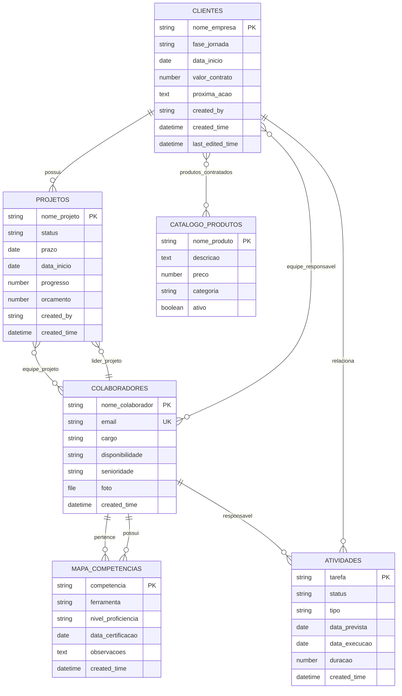
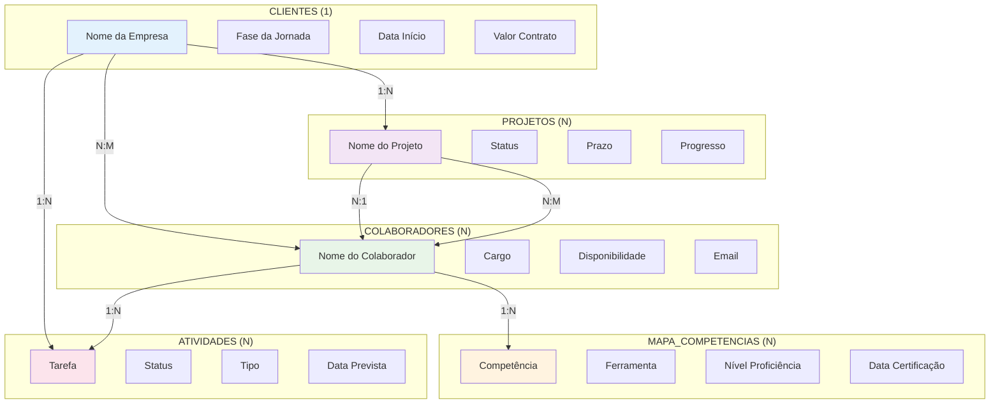
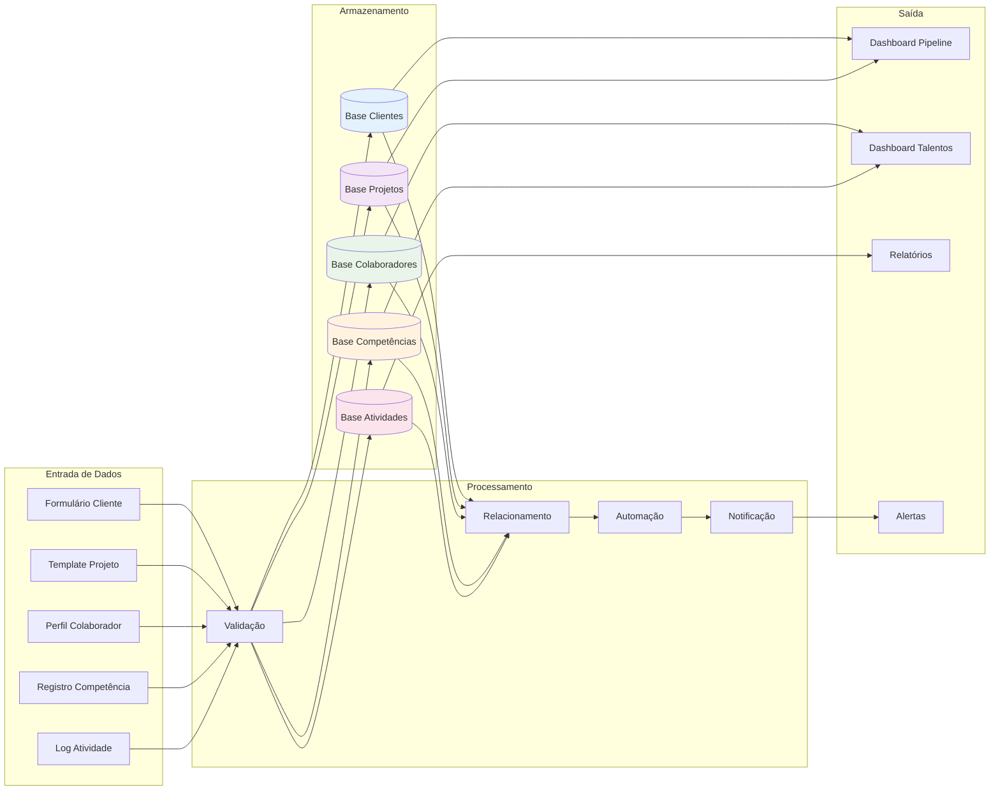
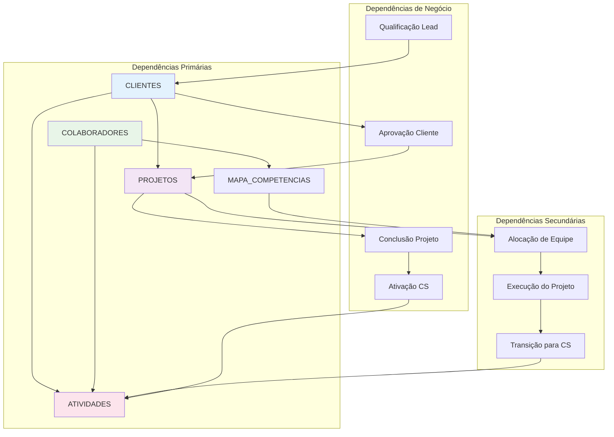
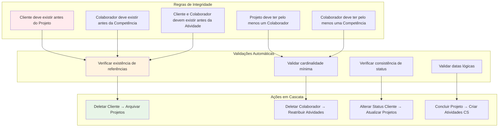
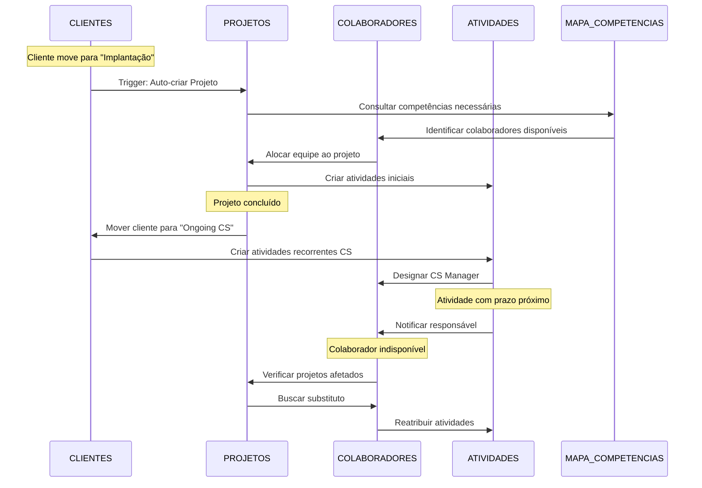
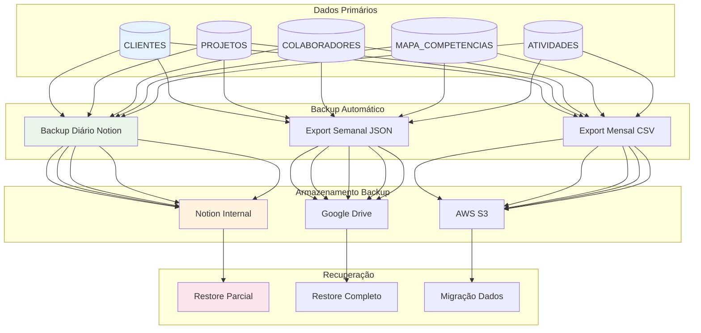

# Diagramas de Relacionamento entre Bases de Dados
## Business OS Integrado no Notion

**Versão:** 1.0  
**Data:** 06 de Setembro de 2025  
**Status:** Em Validação

---

## 1. Diagrama Entidade-Relacionamento (ERD) Principal

## 2. Diagrama de Cardinalidade Detalhado

## 3. Diagrama de Fluxo de Dados

## 4. Matriz de Relacionamentos

| Base Origem | Base Destino | Tipo Relação | Cardinalidade | Campo Chave | Descrição |
|-------------|--------------|--------------|---------------|-------------|-----------|
| CLIENTES | PROJETOS | 1:N | Um cliente pode ter múltiplos projetos | cliente_id | Projetos vinculados ao cliente |
| CLIENTES | ATIVIDADES | 1:N | Um cliente pode ter múltiplas atividades | cliente_id | Atividades relacionadas ao cliente |
| CLIENTES | COLABORADORES | N:M | Múltiplos colaboradores por cliente | equipe_responsavel | Equipe alocada ao cliente |
| PROJETOS | COLABORADORES | N:1 | Um projeto tem um líder | lider_projeto | Líder responsável pelo projeto |
| PROJETOS | COLABORADORES | N:M | Múltiplos colaboradores por projeto | equipe_projeto | Time do projeto |
| COLABORADORES | MAPA_COMPETENCIAS | 1:N | Um colaborador tem múltiplas competências | colaborador_id | Competências do colaborador |
| COLABORADORES | ATIVIDADES | 1:N | Um colaborador executa múltiplas atividades | responsavel_id | Atividades do colaborador |
| CLIENTES | CATALOGO_PRODUTOS | N:M | Cliente pode contratar múltiplos produtos | produtos_contratados | Produtos/serviços contratados |

## 5. Diagrama de Dependências Funcionais

## 6. Diagrama de Integridade Referencial

## 7. Diagrama de Índices e Performance

```mermaid
graph TB
    subgraph "Índices Primários"
        I1[CLIENTES.nome_empresa]
        I2[PROJETOS.nome_projeto]
        I3[COLABORADORES.nome_colaborador]
        I4[MAPA_COMPETENCIAS.competencia]
        I5[ATIVIDADES.tarefa]
    end
    
    subgraph "Índices Secundários"
        S1[CLIENTES.fase_jornada]
        S2[PROJETOS.status]
        S3[COLABORADORES.disponibilidade]
        S4[MAPA_COMPETENCIAS.ferramenta]
        S5[ATIVIDADES.status]
    end
    
    subgraph "Índices Compostos"
        C1[MAPA_COMPETENCIAS.ferramenta + nivel]
        C2[ATIVIDADES.cliente + status]
        C3[PROJETOS.cliente + status]
        C4[COLABORADORES.cargo + disponibilidade]
    end
    
    subgraph "Consultas Frequentes"
        Q1[Buscar colaboradores por competência]
        Q2[Listar projetos por cliente]
        Q3[Filtrar atividades por status]
        Q4[Dashboard pipeline por fase]
    end
    
    C1 --> Q1
    I1 --> Q2
    C2 --> Q3
    S1 --> Q4
    
    style I1 fill:#e3f2fd
    style S1 fill:#f3e5f5
    style C1 fill:#e8f5e8
    style Q1 fill:#fff3e0
```

## 8. Diagrama de Sincronização e Automações

## 9. Diagrama de Backup e Recuperação

## 10. Considerações de Implementação

### 10.1 Ordem de Criação das Bases
1. **COLABORADORES** - Base fundamental para todo o sistema
2. **MAPA_COMPETENCIAS** - Depende de COLABORADORES
3. **CLIENTES** - Base central do negócio
4. **PROJETOS** - Depende de CLIENTES e COLABORADORES
5. **ATIVIDADES** - Depende de todas as anteriores
6. **CATALOGO_PRODUTOS** - Independente, pode ser criada em paralelo

### 10.2 Configuração de Relações
- **Relações bidirecionais**: Sempre configurar ida e volta
- **Nomes consistentes**: Usar convenção de nomenclatura clara
- **Validação**: Implementar regras de negócio nas fórmulas
- **Performance**: Limitar exibição de registros relacionados

### 10.3 Manutenção de Integridade
- **Auditorias regulares**: Verificação semanal de consistência
- **Limpeza de dados**: Remoção de registros órfãos
- **Monitoramento**: Alertas para inconsistências críticas
- **Documentação**: Manter registro de mudanças estruturais

---

**Próximos Passos:**
1. Validar estrutura de relacionamentos com stakeholders
2. Definir regras de negócio específicas para cada relação
3. Criar scripts de validação de integridade
4. Estabelecer procedimentos de manutenção
