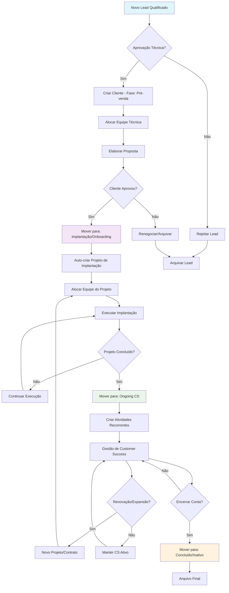
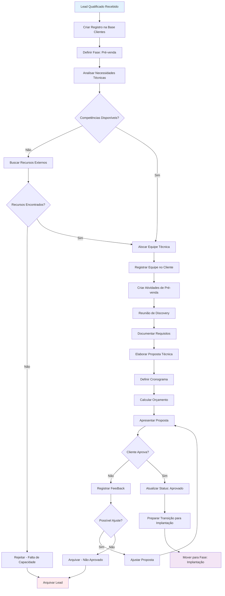
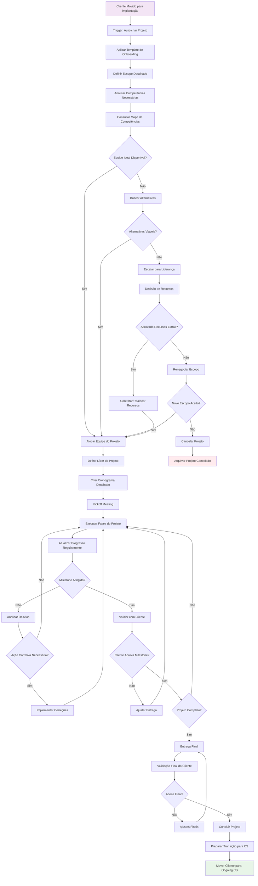
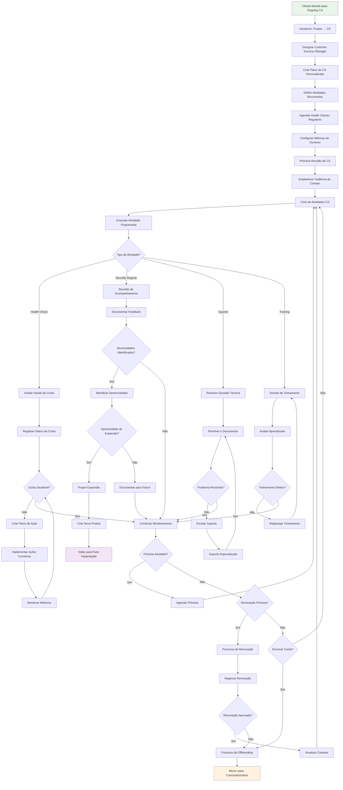
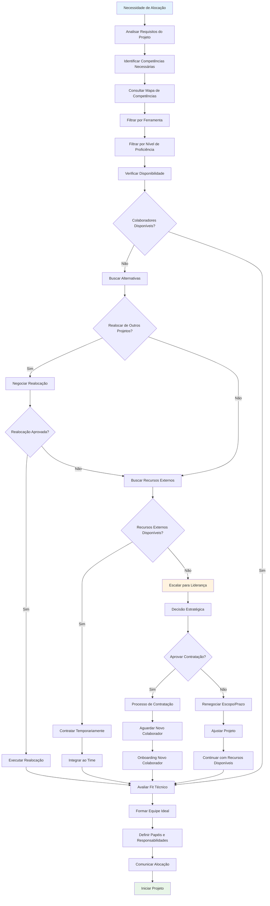
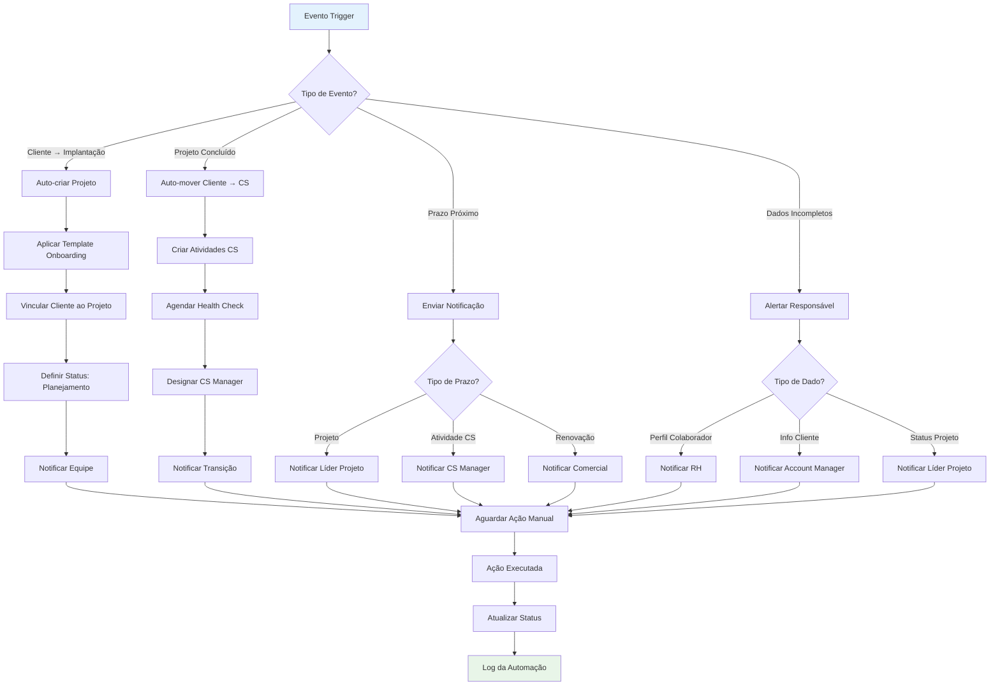

# Fluxogramas da Jornada do Cliente
## Business OS Integrado no Notion

**Versão:** 1.0  
**Data:** 06 de Setembro de 2025  
**Status:** Em Validação

---

## 1. Fluxo Principal da Jornada do Cliente

## 2. Fluxo Detalhado: Fase Pré-venda

## 3. Fluxo Detalhado: Fase Implantação/Onboarding

## 4. Fluxo Detalhado: Fase Ongoing (Customer Success)

## 5. Fluxo de Alocação de Equipe

## 6. Fluxo de Automações Críticas

---

## 7. Pontos de Decisão Críticos

### 7.1 Gates de Qualidade
- **Gate 1**: Aprovação técnica na pré-venda
- **Gate 2**: Disponibilidade de recursos para implantação
- **Gate 3**: Aceite do cliente em cada milestone
- **Gate 4**: Transição bem-sucedida para CS

### 7.2 Escalações Automáticas
- **Falta de recursos**: Escalar para liderança em 24h
- **Atraso em projeto**: Notificar stakeholders em 48h
- **Problemas de CS**: Alertar gerência em tempo real
- **Dados incompletos**: Lembrete diário até resolução

### 7.3 Métricas de Fluxo
- **Tempo médio por fase**: Pré-venda (7 dias), Implantação (30 dias), CS (contínuo)
- **Taxa de conversão**: Pré-venda → Implantação (80%), Implantação → CS (95%)
- **Satisfação**: NPS > 8 em cada transição de fase

---

**Próximos Passos:**
1. Validar fluxos com equipes operacionais
2. Identificar pontos de automação adiciais
3. Definir templates para cada fase
