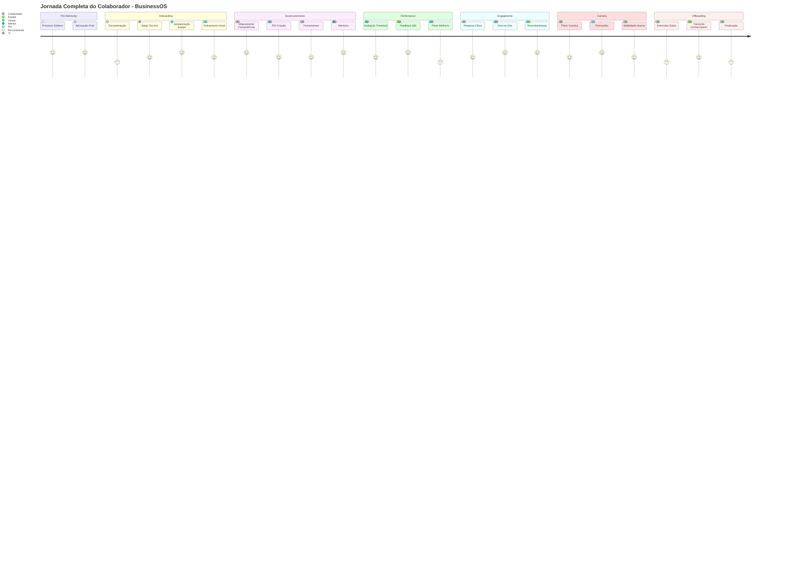
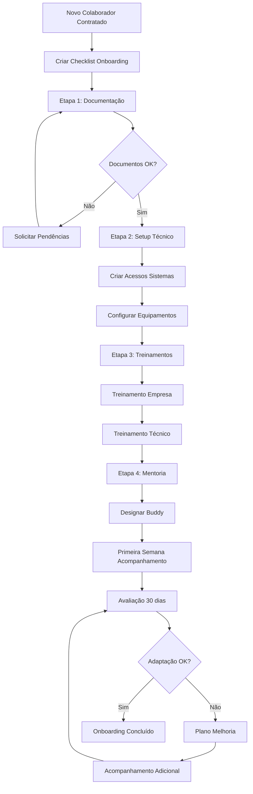
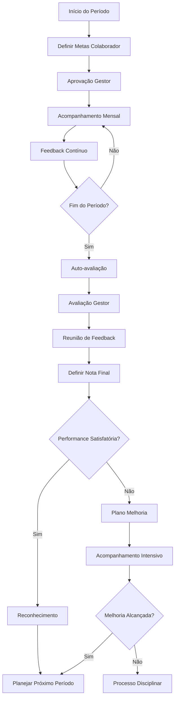
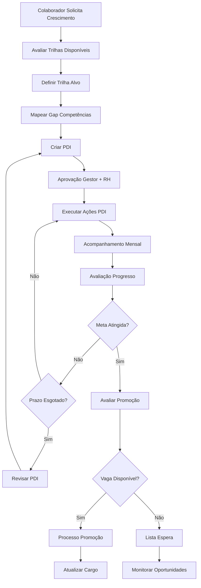

# Jornada Completa do Colaborador
## BusinessOS - Gestão Integral de Pessoas

**Versão:** 1.0  
**Data:** 07 de Setembro de 2025  
**Autor:** Bernardo Chassot, CVO  
**Status:** Especificação Técnica Completa

---

## 📋 **VISÃO GERAL DA JORNADA**

### Objetivo
Implementar uma jornada completa do colaborador no BusinessOS, cobrindo desde o onboarding até o offboarding, com foco em desenvolvimento, performance e bem-estar.

### Escopo Atual vs Expandido



**📊 COBERTURA ATUAL: 30%**
- ✅ Gestão de competências técnicas
- ✅ Alocação em projetos
- ✅ Disponibilidade básica
- ❌ 70% da jornada não coberta

**🎯 COBERTURA EXPANDIDA: 100%**
- ✅ Onboarding estruturado
- ✅ Desenvolvimento e carreira
- ✅ Gestão de performance
- ✅ Bem-estar e engajamento
- ✅ Feedback contínuo
- ✅ Offboarding completo

---

## 🏗️ **ARQUITETURA EXPANDIDA**

### **Bases de Dados Adicionais (7 novas)**

#### **1. ONBOARDING_CHECKLIST**
**Propósito**: Gestão estruturada do processo de integração

| Propriedade | Tipo | Obrigatório | Descrição |
|-------------|------|-------------|-----------|
| Colaborador | Relation → Colaboradores | ✓ | Novo colaborador |
| Etapa | Select | ✓ | Documentação, Setup, Treinamento, Mentoria |
| Descrição | Text | ✓ | Detalhes da etapa |
| Responsável | Relation → Colaboradores | ✓ | Quem deve executar |
| Status | Select | ✓ | Pendente, Em Andamento, Concluído |
| Data Limite | Date | ✓ | Prazo para conclusão |
| Data Conclusão | Date | ✗ | Quando foi finalizado |
| Observações | Long Text | ✗ | Notas e comentários |
| Documentos | Files & Media | ✗ | Anexos necessários |

#### **2. AVALIACOES_PERFORMANCE**
**Propósito**: Ciclos estruturados de avaliação de desempenho

| Propriedade | Tipo | Obrigatório | Descrição |
|-------------|------|-------------|-----------|
| Colaborador | Relation → Colaboradores | ✓ | Avaliado |
| Avaliador | Relation → Colaboradores | ✓ | Gestor responsável |
| Período | Select | ✓ | Trimestral, Semestral, Anual |
| Data Início | Date | ✓ | Início do período |
| Data Fim | Date | ✓ | Fim do período |
| Metas Definidas | Long Text | ✓ | Objetivos do período |
| Resultados Alcançados | Long Text | ✓ | O que foi entregue |
| Nota Performance | Select | ✓ | Abaixo, Atende, Supera Expectativas |
| Pontos Fortes | Long Text | ✓ | Competências destacadas |
| Pontos Melhoria | Long Text | ✓ | Áreas de desenvolvimento |
| Plano Ação | Long Text | ✗ | Próximos passos |
| Status | Select | ✓ | Agendada, Em Andamento, Concluída |

#### **3. PLANO_QUARTER**
**Propósito**: Planos de Desenvolvimento Individual estruturados por trimestre

| Propriedade | Tipo | Obrigatório | Descrição |
|-------------|------|-------------|-----------|
| Colaborador | Relation → Colaboradores | ✓ | Pessoa em desenvolvimento |
| Ano Vigência | Number | ✓ | Ano do PDI |
| Objetivo Desenvolvimento | Text | ✓ | Meta principal |
| Competência Alvo | Relation → Mapa Competências | ✓ | Skill a desenvolver |
| Ações Planejadas | Long Text | ✓ | Como vai desenvolver |
| Recursos Necessários | Text | ✗ | Cursos, mentoria, etc. |
| Prazo | Date | ✓ | Data limite |
| Status | Select | ✓ | Planejado, Em Andamento, Concluído |
| Progresso | Progress | ✗ | % de conclusão |
| Resultado Final | Long Text | ✗ | Avaliação final |
| Próximos Passos | Text | ✗ | Continuidade |

#### **4. FEEDBACK_360**
**Propósito**: Sistema de feedback contínuo multidirecional

| Propriedade | Tipo | Obrigatório | Descrição |
|-------------|------|-------------|-----------|
| Colaborador Avaliado | Relation → Colaboradores | ✓ | Quem recebe feedback |
| Avaliador | Relation → Colaboradores | ✓ | Quem dá feedback |
| Tipo Relação | Select | ✓ | Gestor, Par, Subordinado, Cliente |
| Data Feedback | Date | ✓ | Quando foi dado |
| Categoria | Select | ✓ | Técnica, Comportamental, Liderança |
| Feedback Positivo | Long Text | ✓ | Pontos fortes |
| Feedback Construtivo | Long Text | ✗ | Pontos de melhoria |
| Sugestões | Long Text | ✗ | Recomendações |
| Confidencial | Checkbox | ✓ | Apenas para RH |
| Ação Requerida | Checkbox | ✗ | Precisa de follow-up |
| Status | Select | ✓ | Novo, Lido, Discutido, Arquivado |

#### **5. PESQUISAS_CLIMA**
**Propósito**: Monitoramento de satisfação e engajamento

| Propriedade | Tipo | Obrigatório | Descrição |
|-------------|------|-------------|-----------|
| Colaborador | Relation → Colaboradores | ✓ | Respondente |
| Data Pesquisa | Date | ✓ | Quando respondeu |
| Tipo Pesquisa | Select | ✓ | Pulse, Trimestral, Anual, Saída |
| Satisfação Geral | Rating | ✓ | 1-10 |
| Satisfação Gestor | Rating | ✓ | 1-10 |
| Satisfação Equipe | Rating | ✓ | 1-10 |
| Satisfação Projetos | Rating | ✓ | 1-10 |
| Work Life Balance | Rating | ✓ | 1-10 |
| Crescimento Carreira | Rating | ✓ | 1-10 |
| Recomendaria Empresa | Rating | ✓ | NPS 1-10 |
| Comentários | Long Text | ✗ | Feedback aberto |
| Sugestões Melhoria | Long Text | ✗ | Ideias |
| Anônimo | Checkbox | ✓ | Resposta anônima |

#### **6. OFFBOARDING_PROCESS**
**Propósito**: Gestão estruturada do desligamento

| Propriedade | Tipo | Obrigatório | Descrição |
|-------------|------|-------------|-----------|
| Colaborador | Relation → Colaboradores | ✓ | Quem está saindo |
| Tipo Saída | Select | ✓ | Demissão, Pedido, Aposentadoria |
| Data Comunicação | Date | ✓ | Quando foi comunicado |
| Data Último Dia | Date | ✓ | Último dia de trabalho |
| Motivo Saída | Long Text | ✓ | Razão do desligamento |
| Gestor Responsável | Relation → Colaboradores | ✓ | Quem conduz processo |
| Entrevista Saída | Checkbox | ✓ | Foi realizada |
| Feedback Saída | Long Text | ✗ | Comentários da entrevista |
| Transferência Conhecimento | Checkbox | ✓ | Foi feita |
| Revogação Acessos | Checkbox | ✓ | Sistemas desabilitados |
| Devolução Equipamentos | Checkbox | ✓ | Itens devolvidos |
| Status | Select | ✓ | Iniciado, Em Andamento, Concluído |

#### **7. TRILHAS_CARREIRA**
**Propósito**: Mapeamento de caminhos de crescimento

| Propriedade | Tipo | Obrigatório | Descrição |
|-------------|------|-------------|-----------|
| Nome Trilha | Title | ✓ | Ex: "Dev Frontend Jr → Sr" |
| Cargo Origem | Select | ✓ | Posição inicial |
| Cargo Destino | Select | ✓ | Posição alvo |
| Competências Necessárias | Relation → Mapa Competências | ✓ | Skills obrigatórias |
| Tempo Médio | Number | ✓ | Meses para progressão |
| Pré-requisitos | Long Text | ✓ | Condições necessárias |
| Ações Desenvolvimento | Long Text | ✓ | Como se preparar |
| Critérios Promoção | Long Text | ✓ | Como é avaliado |
| Responsável RH | Relation → Colaboradores | ✓ | Quem acompanha |
| Ativa | Checkbox | ✓ | Trilha disponível |

---

## 🔄 **FLUXOS DE PROCESSO**

### **Fluxo 1: Onboarding Completo**


### **Fluxo 2: Ciclo de Performance**


### **Fluxo 3: Desenvolvimento de Carreira**


---

## 📊 **DASHBOARDS EXPANDIDOS**

### **Dashboard 1: Onboarding Pipeline**
```
📋 VISÃO GERAL:
├── Novos colaboradores por mês
├── Status do checklist por pessoa
├── Tempo médio de onboarding
├── Taxa de conclusão por etapa
├── Responsáveis com tarefas pendentes
└── Satisfação pós-onboarding
```

### **Dashboard 2: Performance Management**
```
📈 MÉTRICAS PERFORMANCE:
├── Distribuição de notas por equipe
├── Metas atingidas vs planejadas
├── Colaboradores em plano de melhoria
├── Ciclos de avaliação em andamento
├── Tendência de performance por período
└── Top performers por competência
```

### **Dashboard 3: Desenvolvimento e Carreira**
```
🎓 CRESCIMENTO:
├── PDIs ativos por colaborador
├── Progresso das trilhas de carreira
├── Competências mais desenvolvidas
├── Tempo médio para promoção
├── Pipeline de sucessão
└── ROI em treinamentos
```

### **Dashboard 4: Clima e Engajamento**
```
😊 WELL-BEING:
├── NPS interno por período
├── Índices de satisfação por área
├── Tendências de clima organizacional
├── Alertas de risco de turnover
├── Feedback 360 em aberto
└── Ações de melhoria implementadas
```

---

## 🔗 **INTEGRAÇÕES E AUTOMAÇÕES**

### **Automações Críticas**
```
🤖 WORKFLOWS AUTOMÁTICOS:
├── Novo colaborador → Criar checklist onboarding
├── Fim período → Disparar ciclo avaliação
├── Meta não atingida → Criar plano melhoria
├── Feedback negativo → Notificar RH
├── PDI vencido → Lembrete gestor
├── Pesquisa clima → Análise automática
└── Offboarding → Revogar acessos
```

### **Notificações Inteligentes**
```
🔔 ALERTAS PROATIVOS:
├── Onboarding atrasado (3 dias)
├── Avaliação pendente (1 semana)
├── PDI sem progresso (30 dias)
├── Feedback 360 não lido (48h)
├── Clima baixo detectado (imediato)
└── Risco turnover alto (semanal)
```

---

## 💰 **IMPACTO FINANCEIRO**

### **Investimento Adicional**
```
💰 DESENVOLVIMENTO JORNADA COLABORADOR:
├── 7 novas bases de dados: R$ 8.400
├── Fluxos e automações: R$ 4.200
├── Dashboards expandidos: R$ 3.600
├── Integrações: R$ 2.400
├── Testes e validação: R$ 1.800
├── Treinamento RH: R$ 1.200
├── TOTAL ADICIONAL: R$ 21.600
└── Implementação: +3 semanas
```

### **ROI Esperado**
```
📈 RETORNO INVESTIMENTO:
├── Redução turnover (50%): R$ 240.000/ano
├── Aumento produtividade (25%): R$ 180.000/ano
├── Redução tempo contratação (30%): R$ 60.000/ano
├── Melhoria clima (NPS +3): R$ 120.000/ano
├── ECONOMIA TOTAL: R$ 600.000/ano
├── ROI: 2.778% em 12 meses
└── Payback: 1.3 meses
```

---

## 🎯 **MÉTRICAS DE SUCESSO**

### **KPIs Onboarding**
- Tempo médio onboarding: <15 dias
- Taxa conclusão checklist: >95%
- Satisfação novos colaboradores: >8.5
- Retenção 6 meses: >90%

### **KPIs Performance**
- Ciclos avaliação no prazo: >95%
- Metas atingidas: >80%
- Colaboradores com PDI ativo: >70%
- Feedback 360 respondido: >85%

### **KPIs Engajamento**
- NPS interno: >8.0
- Turnover voluntário: <10%/ano
- Promoções internas: >60%
- Tempo médio permanência: >2 anos

---

## 📅 **CRONOGRAMA DE IMPLEMENTAÇÃO**

### **Fase 1: Fundação (Semanas 1-2)**
- Criar 7 novas bases de dados
- Configurar relações básicas
- Setup automações críticas

### **Fase 2: Processos (Semanas 3-4)**
- Implementar fluxos de onboarding
- Configurar ciclos de performance
- Criar templates de PDI

### **Fase 3: Dashboards (Semana 5)**
- Desenvolver 4 dashboards RH
- Configurar métricas e KPIs
- Testes de usabilidade

### **Fase 4: Integração (Semana 6)**
- Integrar com sistemas existentes
- Migrar dados históricos
- Treinamento equipe RH

### **Fase 5: Go-Live (Semana 7)**
- Lançamento gradual por área
- Monitoramento intensivo
- Ajustes baseados em feedback

---

**Conclusão**: A implementação da jornada completa do colaborador transforma o BusinessOS em uma plataforma verdadeiramente centrada nas pessoas, aumentando significativamente o ROI através da retenção de talentos, melhoria de performance e engajamento da equipe.
