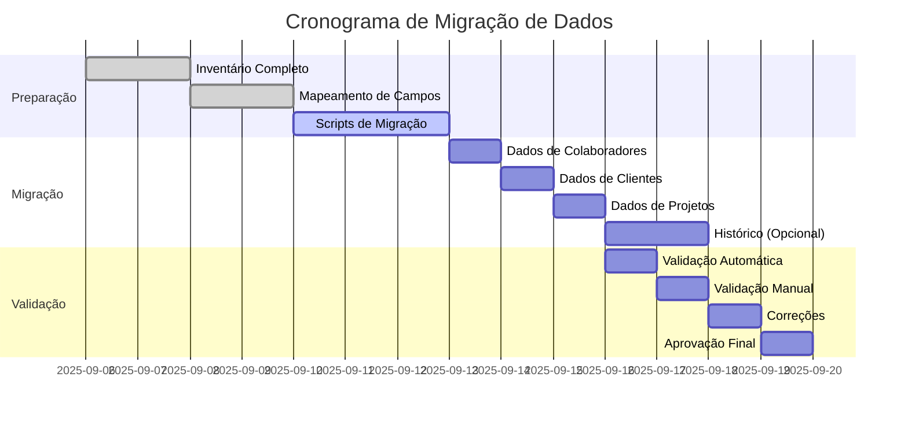

# Estratégia de Migração de Dados
## Business OS Integrado no Notion

**Versão:** 1.0  
**Data:** 06 de Setembro de 2025  
**Status:** Em Validação  
**Responsável:** Tech Lead + Account Managers

---

## 1. Inventário de Sistemas Atuais

### 1.1 Fontes de Dados Identificadas

| Sistema Atual | Tipo de Dados | Volume Estimado | Proprietário | Status |
|---------------|---------------|-----------------|--------------|--------|
| **Excel Clientes** | Lista de clientes ativos | ~200 registros | Account Manager | ✅ Mapeado |
| **Google Sheets Projetos** | Projetos em andamento | ~50 registros | Project Manager | ✅ Mapeado |
| **Planilha RH** | Dados colaboradores | ~25 registros | RH | ✅ Mapeado |
| **Email/WhatsApp** | Histórico comunicações | ~500 threads | Equipe | ⚠️ Não estruturado |
| **Google Drive** | Documentos projetos | ~1000 arquivos | Toda equipe | ⚠️ Disperso |
| **Calendários** | Reuniões e atividades | ~300 eventos/mês | Toda equipe | 🔄 Integração |

### 1.2 Dados Críticos vs Dados Históricos

#### 🔴 **Dados Críticos (Migração Obrigatória)**
- **Clientes Ativos**: Nome, contato, fase atual, valor contrato
- **Projetos em Andamento**: Status, prazos, responsáveis
- **Colaboradores**: Perfis completos, competências atuais
- **Contratos Vigentes**: Valores, prazos, renovações

#### 🟡 **Dados Importantes (Migração Recomendada)**
- **Histórico de Projetos**: Projetos concluídos últimos 12 meses
- **Competências Históricas**: Certificações e treinamentos
- **Métricas Passadas**: Performance histórica para baseline

#### 🟢 **Dados Opcionais (Migração Condicional)**
- **Comunicações Antigas**: Emails e mensagens > 6 meses
- **Documentos Arquivados**: Materiais de projetos antigos
- **Dados de Teste**: Informações de desenvolvimento

## 2. Mapeamento de Campos

### 2.1 Mapeamento: Clientes

| Campo Origem | Sistema Origem | Campo Destino (Notion) | Transformação Necessária |
|--------------|----------------|------------------------|--------------------------|
| Nome Empresa | Excel col A | Nome da Empresa | Limpeza de caracteres especiais |
| Status | Excel col B | Fase da Jornada | Mapeamento: "Ativo"→"Ongoing CS" |
| Contato | Excel col C | Email (nova propriedade) | Validação formato email |
| Valor | Excel col D | Valor Contrato | Conversão para número |
| Início | Excel col E | Data Início | Conversão formato data |
| Responsável | Excel col F | Equipe Responsável | Lookup em base Colaboradores |

#### Regras de Transformação - Clientes
```javascript
// Mapeamento de Status
const statusMapping = {
  "Ativo": "Ongoing CS",
  "Novo": "Pré-venda", 
  "Implantação": "Implantação",
  "Concluído": "Concluído",
  "Cancelado": "Concluído"
}

// Validação de Email
function validateEmail(email) {
  return /^[^\s@]+@[^\s@]+\.[^\s@]+$/.test(email);
}
```

### 2.2 Mapeamento: Projetos

| Campo Origem | Sistema Origem | Campo Destino (Notion) | Transformação Necessária |
|--------------|----------------|------------------------|--------------------------|
| Nome Projeto | Google Sheets A | Nome do Projeto | Padronização nomenclatura |
| Cliente | Google Sheets B | Cliente | Lookup em base Clientes |
| Status | Google Sheets C | Status | Mapeamento de valores |
| Líder | Google Sheets D | Líder do Projeto | Lookup em base Colaboradores |
| Prazo | Google Sheets E | Prazo | Conversão formato data |
| Progresso | Google Sheets F | Progresso | Conversão para % |

### 2.3 Mapeamento: Colaboradores

| Campo Origem | Sistema Origem | Campo Destino (Notion) | Transformação Necessária |
|--------------|----------------|------------------------|--------------------------|
| Nome | Planilha RH A | Nome do Colaborador | Padronização nomes |
| Email | Planilha RH B | Email | Validação formato |
| Cargo | Planilha RH C | Cargo | Padronização títulos |
| Skills | Planilha RH D | Competências | Separação em registros individuais |
| Status | Planilha RH E | Disponibilidade | Mapeamento de valores |

## 3. Scripts de Migração

### 3.1 Script Principal de Migração

```python
# migration_script.py
import pandas as pd
import requests
import json
from datetime import datetime

class NotionMigration:
    def __init__(self, notion_token, database_ids):
        self.token = notion_token
        self.databases = database_ids
        self.headers = {
            "Authorization": f"Bearer {notion_token}",
            "Content-Type": "application/json",
            "Notion-Version": "2022-06-28"
        }
    
    def migrate_clients(self, excel_file):
        """Migrar clientes do Excel para Notion"""
        df = pd.read_excel(excel_file)
        
        for index, row in df.iterrows():
            client_data = {
                "parent": {"database_id": self.databases["clients"]},
                "properties": {
                    "Nome da Empresa": {
                        "title": [{"text": {"content": row["Nome Empresa"]}}]
                    },
                    "Fase da Jornada": {
                        "select": {"name": self.map_status(row["Status"])}
                    },
                    "Valor Contrato": {
                        "number": float(row["Valor"]) if pd.notna(row["Valor"]) else 0
                    },
                    "Data Início": {
                        "date": {"start": row["Início"].strftime("%Y-%m-%d")}
                    }
                }
            }
            
            response = requests.post(
                "https://api.notion.com/v1/pages",
                headers=self.headers,
                json=client_data
            )
            
            if response.status_code == 200:
                print(f"✅ Cliente {row['Nome Empresa']} migrado com sucesso")
            else:
                print(f"❌ Erro ao migrar {row['Nome Empresa']}: {response.text}")
    
    def map_status(self, old_status):
        """Mapear status antigo para novo"""
        mapping = {
            "Ativo": "Ongoing CS",
            "Novo": "Pré-venda",
            "Implantação": "Implantação", 
            "Concluído": "Concluído",
            "Cancelado": "Concluído"
        }
        return mapping.get(old_status, "Pré-venda")

# Configuração
DATABASE_IDS = {
    "clients": "YOUR_CLIENTS_DATABASE_ID",
    "projects": "YOUR_PROJECTS_DATABASE_ID", 
    "collaborators": "YOUR_COLLABORATORS_DATABASE_ID"
}

# Executar migração
migrator = NotionMigration("YOUR_NOTION_TOKEN", DATABASE_IDS)
migrator.migrate_clients("dados_clientes.xlsx")
```

### 3.2 Script de Validação Pós-Migração

```python
# validation_script.py
def validate_migration():
    """Validar integridade dos dados migrados"""
    
    validation_results = {
        "clients": validate_clients(),
        "projects": validate_projects(),
        "collaborators": validate_collaborators()
    }
    
    return validation_results

def validate_clients():
    """Validar dados de clientes"""
    issues = []
    
    # Verificar campos obrigatórios
    clients_missing_data = check_required_fields("clients", ["Nome da Empresa", "Fase da Jornada"])
    if clients_missing_data:
        issues.append(f"Clientes com dados faltantes: {clients_missing_data}")
    
    # Verificar duplicatas
    duplicates = check_duplicates("clients", "Nome da Empresa")
    if duplicates:
        issues.append(f"Clientes duplicados: {duplicates}")
    
    return issues
```

## 4. Cronograma de Migração

### 4.1 Fases da Migração



### 4.2 Cronograma Detalhado

| Data | Atividade | Responsável | Duração | Entregável |
|------|-----------|-------------|---------|------------|
| **06-08/09** | Inventário completo de dados | Account Manager + RH | 2 dias | Lista de fontes validada |
| **09-10/09** | Mapeamento de campos | Tech Lead | 2 dias | Tabelas de mapeamento |
| **11-13/09** | Desenvolvimento scripts | Tech Lead | 3 dias | Scripts testados |
| **16/09** | Migração colaboradores | Tech Lead + RH | 1 dia | Base colaboradores populada |
| **17/09** | Migração clientes | Tech Lead + Account Manager | 1 dia | Base clientes populada |
| **18/09** | Migração projetos | Tech Lead + PM | 1 dia | Base projetos populada |
| **19/09** | Validação automática | Tech Lead | 1 dia | Relatório de validação |
| **20/09** | Validação manual | Toda equipe | 1 dia | Dados aprovados |

## 5. Plano de Validação

### 5.1 Checklist de Validação

#### ✅ **Validação Técnica**
- [ ] **Integridade de Dados**
  - [ ] Todos os registros migrados
  - [ ] Campos obrigatórios preenchidos
  - [ ] Formatos de data corretos
  - [ ] Valores numéricos válidos

- [ ] **Relacionamentos**
  - [ ] Clientes vinculados a projetos
  - [ ] Projetos vinculados a colaboradores
  - [ ] Competências vinculadas a colaboradores
  - [ ] Atividades vinculadas corretamente

- [ ] **Qualidade dos Dados**
  - [ ] Sem registros duplicados
  - [ ] Nomes padronizados
  - [ ] Status mapeados corretamente
  - [ ] Datas dentro de ranges válidos

#### ✅ **Validação de Negócio**
- [ ] **Clientes**
  - [ ] Todos os clientes ativos migrados
  - [ ] Fases corretas atribuídas
  - [ ] Equipes responsáveis corretas
  - [ ] Valores contratuais precisos

- [ ] **Projetos**
  - [ ] Projetos em andamento migrados
  - [ ] Status atualizados
  - [ ] Prazos corretos
  - [ ] Líderes atribuídos corretamente

- [ ] **Colaboradores**
  - [ ] Todos os perfis completos
  - [ ] Competências mapeadas
  - [ ] Disponibilidade atualizada
  - [ ] Cargos padronizados

### 5.2 Critérios de Aceite da Migração

| Critério | Meta | Método de Medição |
|----------|------|-------------------|
| **Taxa de Migração** | >98% dos dados críticos | Contagem automática |
| **Integridade** | 0 registros órfãos | Validação de relacionamentos |
| **Qualidade** | <2% dados inconsistentes | Auditoria manual |
| **Performance** | Migração completa em <8 horas | Monitoramento de tempo |

## 6. Plano de Rollback

### 6.1 Estratégia de Backup

```bash
# Backup pré-migração
backup_date=$(date +%Y%m%d_%H%M%S)
mkdir -p backups/$backup_date

# Exportar dados atuais
notion_export.py --database clients --output backups/$backup_date/clients_backup.json
notion_export.py --database projects --output backups/$backup_date/projects_backup.json
notion_export.py --database collaborators --output backups/$backup_date/collaborators_backup.json
```

### 6.2 Procedimento de Rollback

1. **Detecção de Problema**
   - Monitoramento automático detecta inconsistências
   - Usuários reportam dados incorretos
   - Validação falha nos critérios de aceite

2. **Decisão de Rollback**
   - Avaliar impacto do problema
   - Decidir entre correção ou rollback completo
   - Comunicar decisão aos stakeholders

3. **Execução do Rollback**
   ```bash
   # Parar todas as operações
   stop_migration.py
   
   # Limpar dados migrados
   clear_database.py --database clients
   clear_database.py --database projects
   
   # Restaurar backup
   restore_backup.py --backup backups/20250916_080000/
   
   # Validar restauração
   validate_restore.py
   ```

## 7. Riscos e Mitigações

### 7.1 Riscos Identificados

| Risco | Probabilidade | Impacto | Mitigação |
|-------|---------------|---------|-----------|
| **Perda de dados durante migração** | Baixa | Crítico | Backup completo + testes |
| **Dados inconsistentes** | Média | Alto | Validação rigorosa + correção |
| **Migração incompleta** | Média | Alto | Scripts robustos + monitoramento |
| **Resistência da equipe** | Alta | Médio | Treinamento + suporte intensivo |
| **Performance degradada** | Baixa | Médio | Testes de carga + otimização |

### 7.2 Plano de Contingência

#### **Se Migração Falhar Parcialmente**
1. Identificar dados não migrados
2. Executar migração incremental
3. Validar integridade dos relacionamentos
4. Comunicar status para equipe

#### **Se Dados Ficarem Inconsistentes**
1. Executar scripts de correção
2. Validação manual dos dados críticos
3. Atualização incremental se necessário
4. Documentar lições aprendidas

## 8. Pós-Migração

### 8.1 Monitoramento Contínuo

- **Primeira Semana**: Monitoramento diário da qualidade dos dados
- **Primeiro Mês**: Relatórios semanais de inconsistências
- **Ongoing**: Auditoria mensal de integridade

### 8.2 Suporte à Equipe

- **Sessões de esclarecimento** sobre novos dados
- **Documentação** de mudanças nos processos
- **Canal de suporte** para dúvidas sobre dados migrados

---

**Aprovações Necessárias:**
- [ ] **Bernardo Chassot (CVO)** - Estratégia aprovada
- [ ] **Tech Lead** - Viabilidade técnica confirmada
- [ ] **Account Manager** - Dados de clientes validados
- [ ] **RH** - Dados de colaboradores validados
- [ ] **Project Manager** - Dados de projetos validados

**Data de Aprovação:** ___________  
**Início da Migração:** 16/09/2025
