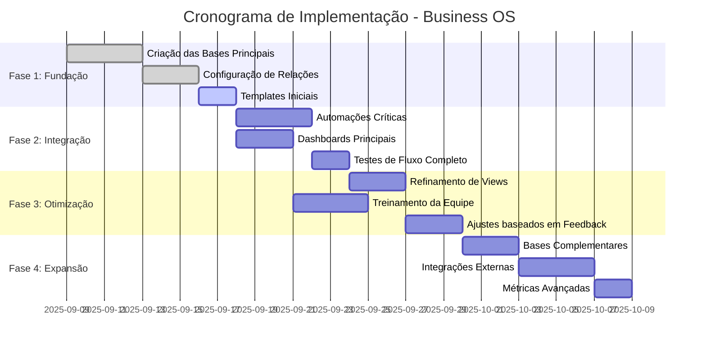

# Cronograma de Implementação
## Business OS Integrado no Notion

**Versão:** 1.0  
**Data:** 06 de Setembro de 2025  
**Status:** Aprovado para Execução

---

## 1. Visão Geral do Cronograma

## 2. Fase 1: Fundação (09-20 Set 2025)

### Semana 1: Criação das Bases Principais
**Período:** 09-13 Setembro 2025  
**Responsável:** Tech Lead + Bernardo Chassot

#### Dia 1 (09/09) - Segunda-feira
- **09:00-12:00** Configuração inicial do Workspace
- **14:00-17:00** Criação da Base COLABORADORES
  - Estrutura de propriedades
  - Configuração de tipos de dados
  - Validações iniciais

#### Dia 2 (10/09) - Terça-feira  
- **09:00-12:00** Criação da Base MAPA_COMPETENCIAS
  - Lista das 12 ferramentas oficiais
  - Níveis de proficiência
  - Relação com COLABORADORES
- **14:00-17:00** Criação da Base CLIENTES
  - Propriedades principais
  - Fases da jornada
  - Configuração de status

#### Dia 3 (11/09) - Quarta-feira
- **09:00-12:00** Criação da Base PROJETOS
  - Estrutura completa
  - Status de projeto
  - Campos de controle
- **14:00-17:00** Criação da Base ATIVIDADES
  - Tipos de atividade
  - Status e responsabilidades
  - Configuração de datas

#### Dia 4 (12/09) - Quinta-feira
- **09:00-12:00** Configuração de Relações Bidirecionais
  - CLIENTES ↔ PROJETOS
  - CLIENTES ↔ COLABORADORES
  - PROJETOS ↔ COLABORADORES
- **14:00-17:00** Configuração de Relações Complementares
  - COLABORADORES ↔ MAPA_COMPETENCIAS
  - ATIVIDADES ↔ CLIENTES
  - ATIVIDADES ↔ COLABORADORES

#### Dia 5 (13/09) - Sexta-feira
- **09:00-12:00** Criação de Templates Iniciais
  - Template Cliente
  - Template Projeto de Onboarding
  - Template Atividade CS
- **14:00-17:00** Testes Básicos e Validação
  - Criação de dados de teste
  - Validação de relações
  - Correção de inconsistências

### Entregáveis Fase 1:
- [ ] 5 bases de dados configuradas e relacionadas
- [ ] Templates básicos funcionais
- [ ] Dados de teste para validação
- [ ] Documentação de configuração

## 3. Fase 2: Integração (16-27 Set 2025)

### Semana 2: Automações e Dashboards
**Período:** 16-20 Setembro 2025  
**Responsável:** Tech Lead + Project Manager

#### Segunda (16/09)
- **Manhã:** Configuração de Automações Críticas
  - Auto-criação de projeto (Cliente → Implantação)
  - Auto-criação de atividades CS (Projeto → Concluído)
- **Tarde:** Testes de Automações
  - Cenários de sucesso
  - Tratamento de erros

#### Terça (17/09)
- **Manhã:** Dashboard Pipeline de Clientes
  - View Board por fase
  - Configuração de cards
  - Filtros básicos
- **Tarde:** Dashboard de Talentos
  - View por competência
  - Agrupamentos por ferramenta
  - Indicadores de disponibilidade

#### Quarta (18/09)
- **Manhã:** Dashboard de Projetos (Timeline)
  - View cronológica
  - Indicadores de status
  - Alertas de prazo
- **Tarde:** Dashboard de Atividades CS
  - View por tipo de atividade
  - Status e responsáveis
  - Calendário de atividades

#### Quinta (19/09)
- **Manhã:** Configuração de Notificações
  - Alertas de prazo
  - Notificações de mudança de fase
  - Comunicação de alocação
- **Tarde:** Testes de Integração Completa
  - Fluxo end-to-end
  - Validação de sincronização
  - Performance inicial

#### Sexta (20/09)
- **Manhã:** Refinamentos baseados em testes
- **Tarde:** Preparação para Fase 3

### Entregáveis Fase 2:
- [ ] 4 dashboards principais funcionais
- [ ] Automações críticas operacionais
- [ ] Sistema de notificações ativo
- [ ] Testes de integração aprovados

## 4. Fase 3: Otimização (23 Set - 04 Out 2025)

### Semana 3: Refinamento e Treinamento
**Período:** 23-27 Setembro 2025  
**Responsável:** Toda a Equipe

#### Segunda (23/09)
- **Manhã:** Refinamento de Views e Filtros
- **Tarde:** Otimização de Performance
- **Responsável:** Tech Lead

#### Terça (24/09)
- **Manhã:** Sessão de Treinamento - Account Managers
- **Tarde:** Sessão de Treinamento - Project Managers
- **Responsável:** Bernardo + Tech Lead

#### Quarta (25/09)
- **Manhã:** Sessão de Treinamento - CS Managers
- **Tarde:** Sessão de Treinamento - RH
- **Responsável:** Bernardo + CS Manager

#### Quinta (26/09)
- **Manhã:** Coleta de Feedback da Equipe
- **Tarde:** Priorização de Ajustes
- **Responsável:** Product Owner

#### Sexta (27/09)
- **Manhã:** Implementação de Ajustes Críticos
- **Tarde:** Validação Final Fase 3
- **Responsável:** Tech Lead

### Semana 4: Ajustes e Preparação Go-Live
**Período:** 30 Set - 04 Outubro 2025

#### Segunda (30/09)
- **Manhã:** Ajustes baseados em Feedback
- **Tarde:** Testes de Usabilidade
- **Responsável:** QA + Product Owner

#### Terça (01/10)
- **Manhã:** Criação de Documentação de Usuário
- **Tarde:** Gravação de Vídeos Tutoriais
- **Responsável:** Product Owner

#### Quarta (02/10)
- **Manhã:** Preparação de Dados Reais
- **Tarde:** Migração de Dados Existentes
- **Responsável:** Tech Lead + Account Managers

#### Quinta (03/10)
- **Manhã:** Testes Finais com Dados Reais
- **Tarde:** Aprovação para Go-Live
- **Responsável:** Bernardo Chassot

#### Sexta (04/10)
- **Manhã:** **🚀 GO-LIVE OFICIAL**
- **Tarde:** Monitoramento Intensivo
- **Responsável:** Toda a Equipe

### Entregáveis Fase 3:
- [ ] Sistema otimizado e refinado
- [ ] Equipe treinada e capacitada
- [ ] Documentação completa
- [ ] Go-live bem-sucedido

## 5. Fase 4: Expansão (07-18 Out 2025)

### Semana 5: Bases Complementares
**Período:** 07-11 Outubro 2025

#### Segunda (07/10)
- **Manhã:** Criação Base CATALOGO_PRODUTOS
- **Tarde:** Relação com CLIENTES
- **Responsável:** Tech Lead

#### Terça (08/10)
- **Manhã:** Criação Base BASE_CONHECIMENTO
- **Tarde:** Estruturação de Conteúdo
- **Responsável:** CS Manager + Tech Lead

#### Quarta (09/10)
- **Manhã:** Dashboard de Produtos e Vendas
- **Tarde:** Relatórios de Revenue
- **Responsável:** Account Manager + Tech Lead

#### Quinta (10/10)
- **Manhã:** Integração com Base de Conhecimento
- **Tarde:** Sistema de Busca Interna
- **Responsável:** Tech Lead

#### Sexta (11/10)
- **Manhã:** Testes das Novas Funcionalidades
- **Tarde:** Ajustes e Otimizações
- **Responsável:** QA

### Semana 6: Integrações e Métricas
**Período:** 14-18 Outubro 2025

#### Segunda (14/10)
- **Manhã:** Integração com Google Calendar
- **Tarde:** Sincronização de Atividades
- **Responsável:** Tech Lead

#### Terça (15/10)
- **Manhã:** Integração com Slack/Teams
- **Tarde:** Notificações Automáticas
- **Responsável:** Tech Lead

#### Quarta (16/10)
- **Manhã:** Dashboard de Métricas Avançadas
- **Tarde:** KPIs e Analytics
- **Responsável:** Product Owner + Tech Lead

#### Quinta (17/10)
- **Manhã:** Relatórios Executivos
- **Tarde:** Dashboards para Liderança
- **Responsável:** Bernardo + Tech Lead

#### Sexta (18/10)
- **Manhã:** Validação Final do Sistema Completo
- **Tarde:** Celebração e Retrospectiva
- **Responsável:** Toda a Equipe

### Entregáveis Fase 4:
- [ ] Bases complementares implementadas
- [ ] Integrações externas funcionais
- [ ] Sistema de métricas avançadas
- [ ] Relatórios executivos operacionais

## 6. Marcos e Checkpoints

### Checkpoint 1 (13/09)
- **Validação:** Bases principais criadas e relacionadas
- **Critério:** Criação e edição de registros funcionais
- **Responsável:** Tech Lead
- **Ação se falhar:** Extensão de 2 dias na Fase 1

### Checkpoint 2 (20/09)
- **Validação:** Dashboards e automações operacionais
- **Critério:** Fluxo completo cliente → projeto → CS funcional
- **Responsável:** Product Owner
- **Ação se falhar:** Revisão de escopo da Fase 3

### Checkpoint 3 (04/10)
- **Validação:** Sistema pronto para go-live
- **Critério:** Todos os critérios de aceite atendidos
- **Responsável:** Bernardo Chassot
- **Ação se falhar:** Adiamento do go-live

### Checkpoint 4 (18/10)
- **Validação:** Sistema completo e otimizado
- **Critério:** OKRs iniciais sendo atingidos
- **Responsável:** Liderança
- **Ação se falhar:** Plano de melhorias imediatas

## 7. Recursos e Responsabilidades

### Equipe Principal
- **Bernardo Chassot (CVO)** - Product Owner e Aprovador Final
- **Tech Lead** - Implementação técnica e arquitetura
- **Project Manager** - Coordenação e acompanhamento
- **CS Manager** - Validação de processos de CS
- **Account Manager** - Validação de processos comerciais
- **RH** - Gestão de competências e treinamento
- **QA** - Testes e validação de qualidade

### Dedicação por Fase
- **Fase 1:** 60% Tech Lead, 40% Bernardo
- **Fase 2:** 80% Tech Lead, 20% Project Manager
- **Fase 3:** 40% toda equipe
- **Fase 4:** 60% Tech Lead, 40% especialistas

## 8. Riscos e Mitigações

### Riscos Técnicos
| Risco | Probabilidade | Impacto | Mitigação |
|-------|---------------|---------|-----------|
| Limitações do Notion | Média | Alto | Prototipagem prévia |
| Performance inadequada | Baixa | Alto | Testes de carga |
| Perda de dados | Baixa | Crítico | Backups diários |

### Riscos de Negócio
| Risco | Probabilidade | Impacto | Mitigação |
|-------|---------------|---------|-----------|
| Resistência da equipe | Média | Alto | Treinamento intensivo |
| Mudança de requisitos | Alta | Médio | Checkpoints frequentes |
| Falta de tempo | Média | Alto | Buffer de 20% no cronograma |

## 9. Critérios de Sucesso

### Sucesso Técnico
- [ ] Sistema 100% funcional conforme especificado
- [ ] Performance dentro dos SLAs definidos
- [ ] Zero perda de dados durante implementação
- [ ] Todos os testes de aceite aprovados

### Sucesso de Negócio
- [ ] 100% da equipe utilizando o sistema
- [ ] Redução de 50% no tempo de alocação
- [ ] NPS do sistema > 8
- [ ] ROI positivo em 90 dias

### Sucesso de Adoção
- [ ] < 5 tickets de suporte por semana após go-live
- [ ] > 95% dos dados migrados corretamente
- [ ] Processos antigos descontinuados
- [ ] Equipe autonoma no uso do sistema

---

## 10. Plano de Contingência

### Se Atraso > 1 Semana
1. Reunião de emergência com stakeholders
2. Repriorização de funcionalidades
3. Aumento temporário de recursos
4. Comunicação transparente com a equipe

### Se Problemas Técnicos Críticos
1. Rollback para processo anterior
2. Análise de causa raiz
3. Solução alternativa temporária
4. Replanejamento da implementação

### Se Resistência da Equipe
1. Sessões individuais de feedback
2. Ajustes baseados em necessidades
3. Programa de incentivos à adoção
4. Comunicação dos benefícios

---

**Aprovação Final:**
- [ ] **Bernardo Chassot (CVO)** - Cronograma aprovado
- [ ] **Tech Lead** - Viabilidade técnica confirmada
- [ ] **Project Manager** - Recursos e prazos validados

**Data de Aprovação:** ___________  
**Assinatura:** ___________
