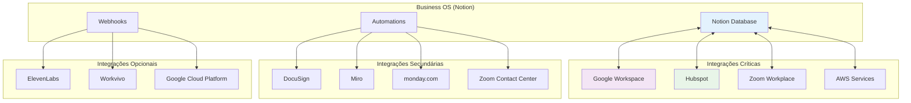
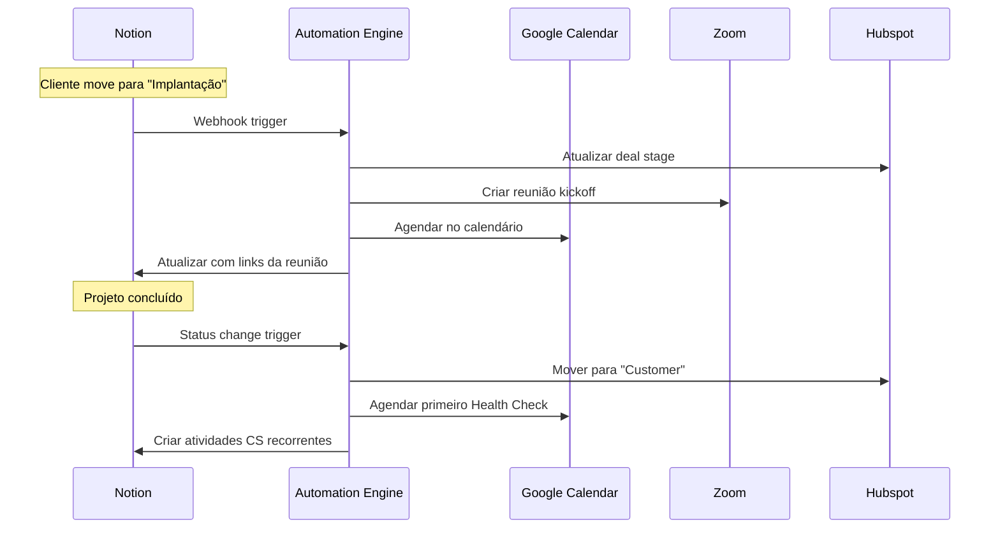

# Guia de Integração com APIs
## Business OS Integrado no Notion

**Versão:** 1.0  
**Data:** 06 de Setembro de 2025  
**Status:** Em Validação  
**Responsável:** Tech Lead

---

## 1. Visão Geral das Integrações

### 1.1 Plataformas Oficiais - Matriz de Integração

| # | Plataforma | Tipo Integração | Prioridade | Status API | Rate Limits | Custo |
|---|------------|----------------|------------|------------|-------------|-------|
| 1 | **AWS** | Infraestrutura | 🔴 Crítica | ✅ Estável | 1000 req/min | Incluído |
| 2 | **DocuSign** | Documentos | 🟡 Alta | ✅ Estável | 100 req/min | $10/mês |
| 3 | **ElevenLabs** | AI Voice | 🟢 Baixa | ✅ Beta | 50 req/min | $5/mês |
| 4 | **Google Cloud Platform** | Infraestrutura | 🔴 Crítica | ✅ Estável | 10000 req/min | Incluído |
| 5 | **Google Workspace** | Produtividade | 🔴 Crítica | ✅ Estável | 100 req/min | Incluído |
| 6 | **Hubspot** | CRM | 🔴 Crítica | ✅ Estável | 100 req/min | Incluído |
| 7 | **Miro** | Colaboração | 🟡 Alta | ✅ Estável | 200 req/min | $8/mês |
| 8 | **monday.com** | Gestão Projetos | 🟡 Alta | ✅ Estável | 60 req/min | Incluído |
| 9 | **Notion** | Base Principal | 🔴 Crítica | ✅ Estável | 3 req/sec | Incluído |
| 10 | **Workvivo** | Comunicação | 🟢 Baixa | ⚠️ Limitada | 50 req/min | $12/mês |
| 11 | **Zoom Contact Center** | Atendimento | 🟡 Alta | ✅ Estável | 80 req/min | Incluído |
| 12 | **Zoom Workplace** | Reuniões | 🔴 Crítica | ✅ Estável | 80 req/min | Incluído |

### 1.2 Arquitetura de Integração



## 2. Especificações por Plataforma

### 2.1 Google Workspace (Crítica)

#### **Funcionalidades Integradas**
- **Calendar**: Sincronização de atividades CS
- **Gmail**: Notificações automáticas
- **Drive**: Armazenamento de documentos de projeto
- **Sheets**: Export de relatórios

#### **Configuração da API**
```javascript
// Google Workspace API Setup
const { google } = require('googleapis');

const auth = new google.auth.GoogleAuth({
  keyFile: 'service-account-key.json',
  scopes: [
    'https://www.googleapis.com/auth/calendar',
    'https://www.googleapis.com/auth/gmail.send',
    'https://www.googleapis.com/auth/drive'
  ]
});

const calendar = google.calendar({ version: 'v3', auth });
const gmail = google.gmail({ version: 'v1', auth });
const drive = google.drive({ version: 'v3', auth });
```

#### **Endpoints Utilizados**
| Endpoint | Método | Uso | Rate Limit |
|----------|--------|-----|------------|
| `/calendar/v3/calendars/{calendarId}/events` | POST | Criar atividades CS | 100/min |
| `/gmail/v1/users/me/messages/send` | POST | Enviar notificações | 100/min |
| `/drive/v3/files` | POST | Upload documentos | 100/min |

#### **Exemplo de Integração - Criar Evento**
```javascript
async function createCalendarEvent(activityData) {
  const event = {
    summary: `${activityData.tipo} - ${activityData.cliente}`,
    description: activityData.descricao,
    start: {
      dateTime: activityData.dataInicio,
      timeZone: 'America/Sao_Paulo'
    },
    end: {
      dateTime: activityData.dataFim,
      timeZone: 'America/Sao_Paulo'
    },
    attendees: activityData.participantes.map(email => ({ email }))
  };

  try {
    const response = await calendar.events.insert({
      calendarId: 'primary',
      resource: event
    });
    return response.data;
  } catch (error) {
    console.error('Erro ao criar evento:', error);
    throw error;
  }
}
```

### 2.2 Hubspot (Crítica)

#### **Funcionalidades Integradas**
- **Contacts**: Sincronização de clientes
- **Deals**: Pipeline de vendas
- **Companies**: Dados empresariais
- **Activities**: Histórico de interações

#### **Configuração da API**
```javascript
// Hubspot API Setup
const hubspot = require('@hubspot/api-client');

const hubspotClient = new hubspot.Client({
  accessToken: process.env.HUBSPOT_ACCESS_TOKEN
});
```

#### **Sincronização Bidirecional**
```javascript
// Sincronizar cliente Notion → Hubspot
async function syncClientToHubspot(notionClient) {
  const contactProperties = {
    email: notionClient.email,
    firstname: notionClient.nome.split(' ')[0],
    lastname: notionClient.nome.split(' ').slice(1).join(' '),
    company: notionClient.empresa,
    lifecyclestage: mapNotionPhaseToHubspot(notionClient.fase)
  };

  try {
    const response = await hubspotClient.crm.contacts.basicApi.create({
      properties: contactProperties
    });
    return response.id;
  } catch (error) {
    console.error('Erro ao sincronizar com Hubspot:', error);
    throw error;
  }
}

function mapNotionPhaseToHubspot(notionPhase) {
  const mapping = {
    'Pré-venda': 'lead',
    'Implantação': 'opportunity',
    'Ongoing CS': 'customer',
    'Concluído': 'other'
  };
  return mapping[notionPhase] || 'lead';
}
```

### 2.3 Zoom Workplace (Crítica)

#### **Funcionalidades Integradas**
- **Meetings**: Criação automática de reuniões CS
- **Webinars**: Treinamentos para clientes
- **Users**: Gestão de participantes

#### **Configuração JWT**
```javascript
// Zoom API Setup
const jwt = require('jsonwebtoken');
const axios = require('axios');

function generateZoomToken() {
  const payload = {
    iss: process.env.ZOOM_API_KEY,
    exp: Math.floor(Date.now() / 1000) + 3600 // 1 hora
  };
  
  return jwt.sign(payload, process.env.ZOOM_API_SECRET);
}

const zoomAPI = axios.create({
  baseURL: 'https://api.zoom.us/v2',
  headers: {
    'Authorization': `Bearer ${generateZoomToken()}`,
    'Content-Type': 'application/json'
  }
});
```

#### **Criar Reunião Automática**
```javascript
async function createZoomMeeting(meetingData) {
  const meetingConfig = {
    topic: `${meetingData.tipo} - ${meetingData.cliente}`,
    type: 2, // Scheduled meeting
    start_time: meetingData.dataInicio,
    duration: meetingData.duracao || 60,
    timezone: 'America/Sao_Paulo',
    settings: {
      host_video: true,
      participant_video: true,
      join_before_host: false,
      mute_upon_entry: true,
      waiting_room: true,
      auto_recording: 'cloud'
    }
  };

  try {
    const response = await zoomAPI.post('/users/me/meetings', meetingConfig);
    return {
      meetingId: response.data.id,
      joinUrl: response.data.join_url,
      password: response.data.password
    };
  } catch (error) {
    console.error('Erro ao criar reunião Zoom:', error);
    throw error;
  }
}
```

### 2.4 AWS Services (Crítica)

#### **Serviços Utilizados**
- **S3**: Backup de dados do Notion
- **Lambda**: Processamento de automações
- **CloudWatch**: Monitoramento e logs
- **SES**: Envio de emails transacionais

#### **Configuração**
```javascript
// AWS SDK Setup
const AWS = require('aws-sdk');

AWS.config.update({
  accessKeyId: process.env.AWS_ACCESS_KEY_ID,
  secretAccessKey: process.env.AWS_SECRET_ACCESS_KEY,
  region: 'us-east-1'
});

const s3 = new AWS.S3();
const lambda = new AWS.Lambda();
const ses = new AWS.SES();
```

#### **Backup Automático para S3**
```javascript
async function backupNotionData(databaseData, databaseName) {
  const timestamp = new Date().toISOString().replace(/[:.]/g, '-');
  const key = `notion-backups/${databaseName}/${timestamp}.json`;
  
  const params = {
    Bucket: 'business-os-backups',
    Key: key,
    Body: JSON.stringify(databaseData, null, 2),
    ContentType: 'application/json',
    ServerSideEncryption: 'AES256'
  };

  try {
    const result = await s3.upload(params).promise();
    console.log(`Backup realizado: ${result.Location}`);
    return result.Location;
  } catch (error) {
    console.error('Erro no backup:', error);
    throw error;
  }
}
```

## 3. Automações e Webhooks

### 3.1 Fluxos de Automação



### 3.2 Configuração de Webhooks

#### **Notion Webhook Handler**
```javascript
// webhook-handler.js
const express = require('express');
const app = express();

app.use(express.json());

app.post('/webhook/notion', async (req, res) => {
  const { event_type, data } = req.body;
  
  try {
    switch (event_type) {
      case 'page.updated':
        await handlePageUpdate(data);
        break;
      case 'database.updated':
        await handleDatabaseUpdate(data);
        break;
      default:
        console.log(`Evento não tratado: ${event_type}`);
    }
    
    res.status(200).json({ success: true });
  } catch (error) {
    console.error('Erro no webhook:', error);
    res.status(500).json({ error: error.message });
  }
});

async function handlePageUpdate(data) {
  // Verificar se é mudança de fase do cliente
  if (data.properties && data.properties['Fase da Jornada']) {
    const newPhase = data.properties['Fase da Jornada'].select.name;
    const clientId = data.id;
    
    await processPhaseChange(clientId, newPhase);
  }
}
```

## 4. Monitoramento e Rate Limits

### 4.1 Estratégia de Rate Limiting

```javascript
// rate-limiter.js
const rateLimit = require('express-rate-limit');
const Redis = require('redis');

const redis = Redis.createClient();

class APIRateLimiter {
  constructor() {
    this.limits = {
      notion: { requests: 3, window: 1000 }, // 3 req/sec
      hubspot: { requests: 100, window: 60000 }, // 100 req/min
      zoom: { requests: 80, window: 60000 }, // 80 req/min
      google: { requests: 100, window: 60000 } // 100 req/min
    };
  }

  async checkLimit(api, identifier) {
    const key = `rate_limit:${api}:${identifier}`;
    const limit = this.limits[api];
    
    const current = await redis.incr(key);
    
    if (current === 1) {
      await redis.expire(key, Math.ceil(limit.window / 1000));
    }
    
    if (current > limit.requests) {
      throw new Error(`Rate limit exceeded for ${api}`);
    }
    
    return true;
  }
}
```

### 4.2 Monitoramento de Saúde das APIs

```javascript
// health-monitor.js
class APIHealthMonitor {
  constructor() {
    this.apis = [
      { name: 'notion', url: 'https://api.notion.com/v1/users/me' },
      { name: 'hubspot', url: 'https://api.hubapi.com/oauth/v1/access-tokens' },
      { name: 'zoom', url: 'https://api.zoom.us/v2/users/me' },
      { name: 'google', url: 'https://www.googleapis.com/oauth2/v1/tokeninfo' }
    ];
  }

  async checkAllAPIs() {
    const results = await Promise.allSettled(
      this.apis.map(api => this.checkAPI(api))
    );

    const report = results.map((result, index) => ({
      api: this.apis[index].name,
      status: result.status === 'fulfilled' ? 'healthy' : 'unhealthy',
      error: result.reason?.message || null,
      timestamp: new Date().toISOString()
    }));

    return report;
  }

  async checkAPI(api) {
    const response = await fetch(api.url, {
      method: 'GET',
      headers: this.getHeaders(api.name)
    });

    if (!response.ok) {
      throw new Error(`API ${api.name} returned ${response.status}`);
    }

    return { status: 'healthy', api: api.name };
  }
}
```

## 5. Segurança e Autenticação

### 5.1 Gestão de Tokens

```javascript
// token-manager.js
const crypto = require('crypto');

class TokenManager {
  constructor() {
    this.tokens = new Map();
  }

  encryptToken(token) {
    const cipher = crypto.createCipher('aes-256-cbc', process.env.ENCRYPTION_KEY);
    let encrypted = cipher.update(token, 'utf8', 'hex');
    encrypted += cipher.final('hex');
    return encrypted;
  }

  decryptToken(encryptedToken) {
    const decipher = crypto.createDecipher('aes-256-cbc', process.env.ENCRYPTION_KEY);
    let decrypted = decipher.update(encryptedToken, 'hex', 'utf8');
    decrypted += decipher.final('utf8');
    return decrypted;
  }

  async refreshToken(api, refreshToken) {
    switch (api) {
      case 'hubspot':
        return await this.refreshHubspotToken(refreshToken);
      case 'google':
        return await this.refreshGoogleToken(refreshToken);
      default:
        throw new Error(`Token refresh not implemented for ${api}`);
    }
  }
}
```

### 5.2 Variáveis de Ambiente

```bash
# .env.example
# Notion
NOTION_TOKEN=secret_xxxxxxxxxxxxxxxxxxxxxxxxxxxxxxxxxxxxxxxx
NOTION_DATABASE_CLIENTS=xxxxxxxxxxxxxxxxxxxxxxxxxxxxxxxx
NOTION_DATABASE_PROJECTS=xxxxxxxxxxxxxxxxxxxxxxxxxxxxxxxx

# Google Workspace
GOOGLE_SERVICE_ACCOUNT_KEY=path/to/service-account-key.json
GOOGLE_CALENDAR_ID=primary

# Hubspot
HUBSPOT_ACCESS_TOKEN=pat-na1-xxxxxxxx-xxxx-xxxx-xxxx-xxxxxxxxxxxx
HUBSPOT_PORTAL_ID=12345678

# Zoom
ZOOM_API_KEY=xxxxxxxxxxxxxxxxxxxxxxxx
ZOOM_API_SECRET=xxxxxxxxxxxxxxxxxxxxxxxxxxxxxxxxxxxxxxxx

# AWS
AWS_ACCESS_KEY_ID=AKIAxxxxxxxxxxxxxxxx
AWS_SECRET_ACCESS_KEY=xxxxxxxxxxxxxxxxxxxxxxxxxxxxxxxxxxxxxxxx
AWS_REGION=us-east-1
AWS_S3_BUCKET=business-os-backups

# Encryption
ENCRYPTION_KEY=your-256-bit-encryption-key-here
```

## 6. Testes e Validação

### 6.1 Testes de Integração

```javascript
// integration.test.js
const { describe, test, expect } = require('@jest/globals');

describe('API Integrations', () => {
  test('Should create Google Calendar event', async () => {
    const activityData = {
      tipo: 'Health Check',
      cliente: 'TechCorp',
      dataInicio: '2025-09-20T10:00:00-03:00',
      dataFim: '2025-09-20T11:00:00-03:00',
      participantes: ['cliente@techcorp.com', 'cs@empresa.com']
    };

    const event = await createCalendarEvent(activityData);
    
    expect(event.id).toBeDefined();
    expect(event.summary).toBe('Health Check - TechCorp');
  });

  test('Should sync client to Hubspot', async () => {
    const notionClient = {
      nome: 'João Silva',
      email: 'joao@techcorp.com',
      empresa: 'TechCorp',
      fase: 'Pré-venda'
    };

    const hubspotId = await syncClientToHubspot(notionClient);
    
    expect(hubspotId).toBeDefined();
    expect(typeof hubspotId).toBe('string');
  });
});
```

### 6.2 Testes de Rate Limiting

```javascript
// rate-limit.test.js
describe('Rate Limiting', () => {
  test('Should respect Notion rate limits', async () => {
    const limiter = new APIRateLimiter();
    
    // Primeira requisição deve passar
    await expect(limiter.checkLimit('notion', 'test')).resolves.toBe(true);
    
    // Quarta requisição no mesmo segundo deve falhar
    await limiter.checkLimit('notion', 'test');
    await limiter.checkLimit('notion', 'test');
    
    await expect(limiter.checkLimit('notion', 'test'))
      .rejects.toThrow('Rate limit exceeded for notion');
  });
});
```

## 7. Documentação de Troubleshooting

### 7.1 Problemas Comuns

| Problema | Causa Provável | Solução |
|----------|----------------|---------|
| **Token expirado** | Refresh token não executado | Renovar token manualmente |
| **Rate limit exceeded** | Muitas requisições simultâneas | Implementar retry com backoff |
| **Webhook não recebido** | URL incorreta ou firewall | Verificar configuração de rede |
| **Dados não sincronizados** | Falha na API externa | Verificar logs e reprocessar |

### 7.2 Logs e Debugging

```javascript
// logger.js
const winston = require('winston');

const logger = winston.createLogger({
  level: 'info',
  format: winston.format.combine(
    winston.format.timestamp(),
    winston.format.errors({ stack: true }),
    winston.format.json()
  ),
  transports: [
    new winston.transports.File({ filename: 'logs/error.log', level: 'error' }),
    new winston.transports.File({ filename: 'logs/combined.log' }),
    new winston.transports.Console({
      format: winston.format.simple()
    })
  ]
});

// Uso
logger.info('Iniciando sincronização com Hubspot', { clientId: '123' });
logger.error('Falha na API do Zoom', { error: error.message, meetingData });
```

---

**Próximos Passos:**
1. Validar credenciais de todas as APIs
2. Implementar testes de conectividade
3. Configurar monitoramento em produção
4. Documentar procedimentos de troubleshooting
