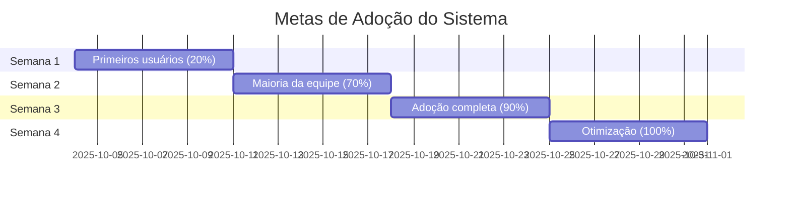

# Métricas Baseline e Contexto
## Business OS Integrado no Notion

**Versão:** 1.0  
**Data:** 06 de Setembro de 2025  
**Status:** Em Validação  
**Responsável:** Product Owner + Tech Lead

---

## 1. Estado Atual (Baseline) - Setembro 2025

### 1.1 Métricas de Processo Atuais

#### **Gestão de Clientes**
| Métrica | Valor Atual | Método de Coleta | Fonte |
|---------|-------------|------------------|-------|
| **Tempo médio pré-venda** | 14 dias | Análise manual de emails | Gmail + Planilhas |
| **Taxa conversão pré-venda → implantação** | 65% | Contagem manual | Excel clientes |
| **Tempo médio de implantação** | 45 dias | Tracking em Google Sheets | Projetos.xlsx |
| **Taxa sucesso implantação** | 85% | Avaliação manual | Feedback clientes |
| **Clientes ativos simultâneos** | 47 clientes | Contagem manual | Planilha principal |

#### **Alocação de Recursos**
| Métrica | Valor Atual | Método de Coleta | Fonte |
|---------|-------------|------------------|-------|
| **Tempo para alocar equipe** | 5-8 dias | Estimativa PM | Experiência |
| **Taxa ocupação da equipe** | ~80% | Estimativa visual | Calendários |
| **Conflitos de alocação/mês** | 8-12 casos | Contagem manual | Reuniões semanais |
| **Projetos simultâneos/pessoa** | 2-3 projetos | Contagem manual | Planilhas |
| **Tempo ocioso médio** | 15-20% | Estimativa | Observação |

#### **Customer Success**
| Métrica | Valor Atual | Método de Coleta | Fonte |
|---------|-------------|------------------|-------|
| **Frequência Health Checks** | Irregular (2-6 meses) | Análise calendários | Google Calendar |
| **Tempo resposta suporte** | 24-48h | Estimativa | WhatsApp/Email |
| **NPS atual** | Não medido | - | - |
| **Taxa renovação** | ~90% | Contagem manual | Contratos |
| **Atividades CS/cliente/mês** | 1-2 atividades | Estimativa | Calendários |

### 1.2 Métricas Operacionais Atuais

#### **Produtividade da Equipe**
| Métrica | Valor Atual | Impacto | Observações |
|---------|-------------|---------|-------------|
| **Horas/semana em admin** | 8-12h/pessoa | 🔴 Alto | Planilhas, emails, busca info |
| **Reuniões de alinhamento** | 6h/semana | 🟡 Médio | Status, alocação, problemas |
| **Tempo busca informações** | 2-3h/dia | 🔴 Alto | Dados espalhados |
| **Retrabalho por falta de info** | 10-15% | 🔴 Alto | Decisões baseadas em dados desatualizados |

#### **Qualidade dos Dados**
| Aspecto | Estado Atual | Problemas Identificados |
|---------|--------------|------------------------|
| **Dados de clientes** | 📊 70% completos | Informações em emails, falta padronização |
| **Status de projetos** | 📊 60% atualizados | Atualizações manuais irregulares |
| **Competências da equipe** | 📊 40% mapeadas | Conhecimento tácito, não documentado |
| **Histórico de atividades** | 📊 30% registrado | Apenas reuniões formais registradas |

## 2. Metas e Contexto dos OKRs

### 2.1 OKR 1: 100% Novos Clientes no Sistema

#### **Contexto Atual**
- **Clientes novos/mês**: 8-12 clientes
- **Processo atual**: Email → Excel → Comunicação verbal
- **Tempo de cadastro**: 30-45 minutos/cliente
- **Dados perdidos**: ~20% informações importantes

#### **Meta Específica**
```
DE: 65% clientes com dados completos e atualizados
PARA: 100% novos clientes cadastrados no sistema em <5 minutos
PRAZO: 30 dias pós go-live
MEDIÇÃO: Dashboard automático de completude
```

#### **Impacto Esperado**
- ⏱️ **Redução tempo cadastro**: 30min → 5min (83% redução)
- 📊 **Melhoria qualidade dados**: 70% → 100% (43% melhoria)
- 🔄 **Automatização follow-ups**: Manual → Automático
- 👥 **Visibilidade equipe**: Limitada → Total

### 2.2 OKR 2: 100% Perfis Colaboradores Preenchidos

#### **Contexto Atual**
- **Colaboradores ativos**: 25 pessoas
- **Perfis documentados**: 10 pessoas (40%)
- **Competências mapeadas**: Conhecimento tácito
- **Atualizações**: Anuais ou quando necessário

#### **Meta Específica**
```
DE: 40% colaboradores com competências documentadas
PARA: 100% perfis completos com competências nas 12 ferramentas
PRAZO: 15 dias pós go-live
MEDIÇÃO: Dashboard RH com % completude
```

#### **Impacto Esperado**
- 🎯 **Precisão alocação**: 60% → 90% (50% melhoria)
- ⏱️ **Tempo busca recursos**: 2-3 dias → <1 dia (70% redução)
- 📈 **Desenvolvimento equipe**: Ad-hoc → Planejado
- 🔍 **Identificação gaps**: Manual → Automático

### 2.3 OKR 3: 50% Redução Tempo Alocação

#### **Contexto Atual**
- **Tempo atual alocação**: 5-8 dias
- **Processo**: Reunião → Análise → Negociação → Confirmação
- **Conflitos**: 8-12 casos/mês
- **Informações**: Dispersas em calendários e conversas

#### **Meta Específica**
```
DE: 5-8 dias para alocar equipe ideal
PARA: 2-4 dias para alocar equipe ideal (50% redução)
PRAZO: 45 dias pós go-live
MEDIÇÃO: Tempo médio entre criação projeto e equipe definida
```

#### **Impacto Esperado**
- ⚡ **Velocidade projetos**: Início 50% mais rápido
- 🎯 **Qualidade alocação**: Baseada em dados vs intuição
- 📉 **Conflitos recursos**: 8-12 → 2-4 casos/mês (70% redução)
- 💰 **Eficiência financeira**: Melhor utilização recursos

## 3. Métricas de Performance Técnica

### 3.1 Benchmarks Atuais (Sistemas Existentes)

#### **Tempo de Resposta**
| Sistema | Operação | Tempo Atual | Meta Notion |
|---------|----------|-------------|-------------|
| **Excel** | Abrir planilha clientes | 5-10s | <3s |
| **Google Sheets** | Carregar projetos | 3-8s | <3s |
| **Email** | Buscar informação | 30-120s | <5s |
| **WhatsApp** | Encontrar conversa | 15-60s | <2s |

#### **Disponibilidade**
| Sistema | Uptime Atual | Meta |
|---------|--------------|------|
| **Google Workspace** | 99.9% | 99.9% |
| **Excel local** | 95% (depende do device) | 99.5% |
| **Internet** | 98% | 99.5% |

### 3.2 Metas de Performance Técnica

#### **Responsividade do Sistema**
```
Dashboard Pipeline: <3s carregamento inicial
Busca colaboradores: <2s resultados
Criação de cliente: <5s processo completo
Sincronização dados: <10s entre sistemas
Mobile responsivo: 100% funcionalidades
```

#### **Confiabilidade**
```
Uptime sistema: >99.5%
Backup automático: Diário
Recovery time: <1h
Data loss: 0%
```

## 4. Métricas de Adoção e Satisfação

### 4.1 Baseline de Satisfação

#### **Satisfação com Processos Atuais**
| Aspecto | Score Atual (1-10) | Principais Reclamações |
|---------|-------------------|----------------------|
| **Facilidade encontrar informações** | 4/10 | "Dados espalhados", "Demora para achar" |
| **Agilidade processos** | 5/10 | "Muito manual", "Retrabalho" |
| **Visibilidade projetos** | 3/10 | "Não sei status", "Falta transparência" |
| **Comunicação equipe** | 6/10 | "WhatsApp confuso", "Info perdida" |
| **Eficiência reuniões** | 4/10 | "Muito tempo alinhando", "Falta contexto" |

#### **Expectativas para Novo Sistema**
| Expectativa | Prioridade | Meta Score |
|-------------|------------|------------|
| **Informações centralizadas** | 🔴 Crítica | 9/10 |
| **Processos automatizados** | 🔴 Crítica | 8/10 |
| **Visibilidade total** | 🟡 Alta | 9/10 |
| **Facilidade de uso** | 🟡 Alta | 8/10 |
| **Economia de tempo** | 🔴 Crítica | 9/10 |

### 4.2 Metas de Adoção

#### **Cronograma de Adoção**


#### **Métricas de Sucesso da Adoção**
| Métrica | Semana 1 | Semana 2 | Semana 3 | Semana 4 |
|---------|----------|----------|----------|----------|
| **Usuários ativos diários** | 20% | 70% | 90% | 95% |
| **Clientes cadastrados no sistema** | 50% | 80% | 95% | 100% |
| **Projetos gerenciados no sistema** | 30% | 70% | 90% | 100% |
| **Atividades registradas** | 40% | 70% | 85% | 95% |

## 5. ROI e Impacto Financeiro

### 5.1 Custos Atuais (Baseline)

#### **Custos de Ineficiência**
| Item | Custo Mensal | Cálculo | Impacto Anual |
|------|--------------|---------|---------------|
| **Tempo admin da equipe** | R$ 15.000 | 25 pessoas × 10h/mês × R$ 60/h | R$ 180.000 |
| **Retrabalho por falta de info** | R$ 8.000 | 15% projetos × R$ 50.000 médio | R$ 96.000 |
| **Atraso em projetos** | R$ 12.000 | 20% projetos × multa/atraso | R$ 144.000 |
| **Oportunidades perdidas** | R$ 20.000 | 2 clientes/mês × R$ 10.000 | R$ 240.000 |
| **Total custos ineficiência** | **R$ 55.000** | | **R$ 660.000** |

#### **Custos do Novo Sistema**
| Item | Custo Mensal | Custo Anual |
|------|--------------|-------------|
| **Notion Pro (25 usuários)** | R$ 400 | R$ 4.800 |
| **Integrações (APIs)** | R$ 200 | R$ 2.400 |
| **Manutenção/Suporte** | R$ 1.000 | R$ 12.000 |
| **Treinamento (one-time)** | - | R$ 5.000 |
| **Total custos sistema** | **R$ 1.600** | **R$ 24.200** |

### 5.2 ROI Projetado

#### **Economia Esperada**
```
Redução custos ineficiência: 70% × R$ 660.000 = R$ 462.000/ano
Custo do sistema: R$ 24.200/ano
Economia líquida: R$ 437.800/ano
ROI: 1.809% (18x retorno)
Payback: 1.3 meses
```

#### **Benefícios Intangíveis**
- 🎯 **Melhoria satisfação equipe**: Menos frustração, mais produtividade
- 🚀 **Agilidade decisões**: Dados em tempo real
- 📈 **Crescimento sustentável**: Processos escaláveis
- 🏆 **Vantagem competitiva**: Operação mais eficiente

## 6. Plano de Medição

### 6.1 Dashboard de Métricas

#### **Métricas em Tempo Real**
```
📊 DASHBOARD EXECUTIVO
├── Clientes no Sistema: 47/47 (100%)
├── Perfis Completos: 25/25 (100%) 
├── Tempo Médio Alocação: 2.3 dias (-65%)
├── Projetos no Prazo: 18/20 (90%)
├── NPS Sistema: 8.7/10
└── ROI Acumulado: R$ 145.000
```

#### **Relatórios Semanais**
- **Segunda**: Métricas de adoção e uso
- **Quarta**: Performance técnica e qualidade dados
- **Sexta**: ROI e impacto nos processos

### 6.2 Ferramentas de Medição

#### **Automáticas (Notion Analytics)**
- Usuários ativos diários/semanais
- Tempo gasto em cada dashboard
- Operações mais utilizadas
- Dados de performance técnica

#### **Manuais (Surveys)**
- NPS mensal do sistema
- Satisfação com processos
- Feedback qualitativo
- Sugestões de melhoria

---

**Próximos Passos:**
1. Validar métricas baseline com equipe
2. Configurar ferramentas de medição
3. Estabelecer rotina de acompanhamento
4. Definir gatilhos para ações corretivas
