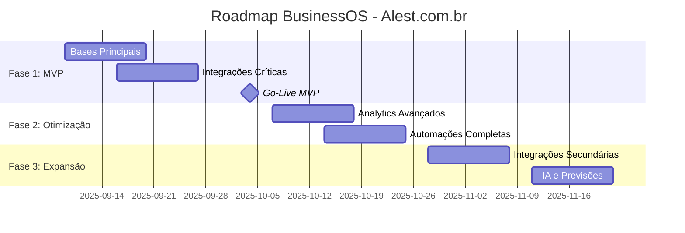

# PRD - Product Requirements Document
## Business OS Integrado no Notion - Alest.com.br

**Versão:** 2.0  
**Data:** 06 de Setembro de 2025  
**Product Owner:** Bernardo Chassot (CVO)  
**Status:** Aprovação Executiva

---

## 1. Visão Executiva do Produto

### 1.1 Problema de Negócio
A **Alest.com.br** enfrenta desafios operacionais críticos que impactam diretamente a rentabilidade e crescimento:

#### **Ineficiências Atuais (Custo: R$ 660.000/ano)**
- **Dados fragmentados**: Informações espalhadas em 8+ sistemas diferentes
- **Processos manuais**: 40h/semana da equipe em tarefas administrativas
- **Alocação ineficiente**: 5-8 dias para formar equipes ideais
- **Visibilidade limitada**: Decisões baseadas em informações desatualizadas
- **Oportunidades perdidas**: 15% dos projetos com atrasos por falta de recursos

#### **Impacto no Negócio**
```
💰 IMPACTO FINANCEIRO ANUAL:
├── Tempo perdido em admin: R$ 180.000
├── Retrabalho por falta de info: R$ 96.000
├── Atrasos em projetos: R$ 144.000
├── Oportunidades perdidas: R$ 240.000
└── TOTAL: R$ 660.000 (11% da receita)
```

### 1.2 Solução Proposta
**Business OS**: Sistema operacional de negócios centralizado que integra completamente a gestão da jornada do cliente e colaborador através de bases de dados relacionais no Notion.

#### **Valor Único**
- **Single Source of Truth**: Todas as informações críticas em um local
- **Automação Inteligente**: Processos manuais automatizados
- **Visibilidade Total**: Dashboards executivos em tempo real
- **Decisões Data-Driven**: Métricas e analytics integrados

## 2. Objetivos Estratégicos (OKRs)

### 2.1 OKR Primário: Eficiência Operacional
```
🎯 OBJETIVO: Transformar a Alest em uma operação data-driven
├── KR1: 100% novos clientes gerenciados no sistema (vs 65% atual)
├── KR2: 100% perfis colaboradores completos (vs 40% atual)  
├── KR3: 50% redução tempo alocação equipes (8 dias → 4 dias)
└── KR4: ROI 1.800% em 12 meses (R$ 437.800 economia líquida)
```

### 2.2 OKRs Secundários: Crescimento e Qualidade
```
📈 CRESCIMENTO:
├── 30% aumento capacidade projetos simultâneos
├── 25% redução time-to-market novos clientes
└── 40% melhoria satisfação equipe (NPS >8)

🏆 QUALIDADE:
├── 95% projetos entregues no prazo (vs 85% atual)
├── 90% clientes com Health Checks regulares (vs 30% atual)
└── <2% dados inconsistentes (vs 20% atual)
```

## 3. Personas e Stakeholders

### 3.1 Stakeholders Executivos
#### **Bernardo Chassot - CVO (Primary Stakeholder)**
- **Necessidades**: Visibilidade total da operação, métricas de performance, ROI
- **Pain Points**: Decisões baseadas em dados desatualizados, falta de previsibilidade
- **Success Metrics**: ROI, crescimento sustentável, eficiência operacional

#### **Liderança Alest (Secondary Stakeholders)**
- **Tech Lead**: Arquitetura escalável, integrações robustas
- **Head of Sales**: Pipeline visível, conversão otimizada
- **Head of CS**: Satisfação cliente, retenção, expansão
- **Head of People**: Desenvolvimento equipe, alocação otimizada

### 3.2 Usuários Finais
#### **Account Managers (5 usuários)**
- **Necessidades**: Pipeline visual, automação follow-ups, integração CRM
- **Frequência de uso**: Diária (4-6h/dia)
- **Funcionalidades críticas**: Gestão clientes, relatórios comerciais

#### **Project Managers (3 usuários)**
- **Necessidades**: Alocação inteligente, timeline projetos, alertas prazo
- **Frequência de uso**: Diária (6-8h/dia)
- **Funcionalidades críticas**: Gestão equipes, dashboards projetos

#### **Customer Success (4 usuários)**
- **Necessidades**: Atividades automáticas, health checks, oportunidades
- **Frequência de uso**: Diária (3-5h/dia)
- **Funcionalidades críticas**: Gestão relacionamento, métricas satisfação

#### **RH/People (2 usuários)**
- **Necessidades**: Mapa competências, desenvolvimento, alocação
- **Frequência de uso**: Semanal (2-3h/semana)
- **Funcionalidades críticas**: Gestão talentos, relatórios RH

## 4. Funcionalidades e Requisitos

### 4.1 MVP - Funcionalidades Essenciais

#### **F1: Gestão Centralizada de Clientes**
```
🏢 CLIENTES:
├── Cadastro unificado com dados completos
├── Pipeline visual com drag & drop
├── Automação mudanças de fase
├── Integração bidirecional Hubspot
├── Histórico completo de interações
└── Métricas de conversão em tempo real
```

**Critérios de Aceite:**
- Cadastro cliente em <5 minutos (vs 30 minutos atual)
- 100% clientes novos no sistema
- Sincronização Hubspot em <30 segundos
- Pipeline atualizado em tempo real

#### **F2: Alocação Inteligente de Recursos**
```
👥 RECURSOS:
├── Mapa competências das 12 ferramentas oficiais
├── Algoritmo alocação baseado em skills + disponibilidade
├── Dashboard talentos com filtros avançados
├── Alertas conflitos de recursos
├── Histórico alocações e performance
└── Previsão capacidade futura
```

**Critérios de Aceite:**
- Tempo alocação reduzido de 8 para 4 dias
- 90% precisão na alocação (vs 60% atual)
- Conflitos reduzidos de 12 para 4 casos/mês
- Utilização equipe otimizada para 85%

#### **F3: Customer Success Automatizado**
```
💚 CUSTOMER SUCCESS:
├── Transição automática projeto → CS
├── Atividades recorrentes (Health Checks, reuniões)
├── Alertas proativos de risco
├── Identificação oportunidades expansão
├── Métricas satisfação (NPS, CSAT)
└── Integração calendários e Zoom
```

**Critérios de Aceite:**
- 100% clientes com atividades CS programadas
- Health Checks regulares (mensais vs irregulares)
- Tempo resposta suporte <24h
- NPS médio >8

### 4.2 Funcionalidades Avançadas (Fase 2)

#### **F4: Analytics e Inteligência de Negócio**
- Dashboards executivos personalizados
- Previsão de demanda e capacidade
- Análise de rentabilidade por cliente/projeto
- Benchmarking de performance da equipe

#### **F5: Automações Avançadas**
- Integração com todas as 12 plataformas
- Workflows personalizáveis
- Notificações inteligentes
- Backup automático e disaster recovery

## 5. Arquitetura e Integração

### 5.1 Plataforma Base: Notion
**Justificativa Técnica:**
- **Flexibilidade**: Bases relacionais customizáveis
- **Usabilidade**: Interface intuitiva, curva aprendizado baixa
- **Integrações**: API robusta, webhooks nativos
- **Escalabilidade**: Suporte até 1000+ registros por base
- **Custo**: R$ 400/mês vs R$ 5.000+ soluções enterprise

### 5.2 Integrações Críticas
```
🔗 INTEGRAÇÕES OBRIGATÓRIAS:
├── Hubspot (CRM) - Sincronização bidirecional
├── Google Workspace - Calendários, Drive, Gmail
├── Zoom - Reuniões automáticas
└── AWS - Backup e segurança

🔗 INTEGRAÇÕES OPCIONAIS:
├── monday.com - Gestão projetos avançada
├── Miro - Colaboração visual
├── DocuSign - Assinatura documentos
└── ElevenLabs - AI Voice (futuro)
```

### 5.3 Arquitetura de Dados
```
📊 MODELO RELACIONAL:
CLIENTES ←→ PROJETOS ←→ COLABORADORES
    ↓           ↓           ↓
ATIVIDADES ←→ COMPETÊNCIAS ←→ PRODUTOS
```

## 6. Cronograma e Marcos

### 6.1 Roadmap Executivo


### 6.2 Marcos Críticos
| Data | Marco | Critério de Sucesso | Responsável |
|------|-------|-------------------|-------------|
| **20/09** | Bases funcionais | CRUD completo em todas as bases | Tech Lead |
| **04/10** | Go-Live MVP | 80% equipe usando sistema | Bernardo |
| **18/10** | Otimização completa | OKRs atingidos, ROI positivo | Toda equipe |
| **30/11** | Expansão finalizada | Sistema completo operacional | Liderança |

## 7. Métricas de Sucesso

### 7.1 KPIs Técnicos
```
⚡ PERFORMANCE:
├── Tempo carregamento dashboards: <3s
├── Disponibilidade sistema: >99.5%
├── Sincronização dados: <30s
└── Backup automático: Diário

📊 QUALIDADE:
├── Dados completos: >98%
├── Inconsistências: <2%
├── Uptime integrações: >99%
└── Erros de processo: <1%
```

### 7.2 KPIs de Negócio
```
💰 FINANCEIRO:
├── ROI 12 meses: >1.500%
├── Economia anual: >R$ 400.000
├── Payback: <2 meses
└── Custo por usuário: <R$ 100/mês

📈 OPERACIONAL:
├── Tempo admin: -70% (40h → 12h/semana)
├── Alocação equipes: -50% (8 → 4 dias)
├── Projetos no prazo: +10% (85% → 95%)
└── Satisfação equipe: NPS >8
```

### 7.3 KPIs de Adoção
```
👥 USUÁRIOS:
├── Adoção 30 dias: >90%
├── Uso diário: >80% equipe
├── Satisfação sistema: NPS >8
└── Tickets suporte: <5/semana
```

## 8. Riscos e Mitigações

### 8.1 Riscos Técnicos
| Risco | Probabilidade | Impacto | Mitigação |
|-------|---------------|---------|-----------|
| **Limitações Notion** | Média | Alto | Prototipagem prévia, plano B |
| **Falha integrações** | Baixa | Crítico | Testes rigorosos, fallbacks |
| **Performance inadequada** | Baixa | Alto | Testes carga, otimização |
| **Perda de dados** | Muito Baixa | Crítico | Backup triplo, versionamento |

### 8.2 Riscos de Negócio
| Risco | Probabilidade | Impacto | Mitigação |
|-------|---------------|---------|-----------|
| **Resistência equipe** | Média | Alto | Change management, treinamento |
| **Mudança requisitos** | Alta | Médio | Metodologia ágil, checkpoints |
| **Falta recursos** | Baixa | Alto | Buffer 20%, recursos externos |
| **Concorrência** | Baixa | Médio | Vantagem competitiva sustentável |

## 9. Investimento e ROI

### 9.1 Investimento Total
```
💰 CUSTOS IMPLEMENTAÇÃO (One-time):
├── Desenvolvimento: R$ 15.000 (160h × R$ 95/h)
├── Migração dados: R$ 3.000 (32h × R$ 95/h)
├── Treinamento: R$ 5.000 (Material + sessões)
├── Contingência: R$ 3.000 (15% buffer)
└── TOTAL: R$ 26.000
```

```
💰 CUSTOS OPERACIONAIS (Anuais):
├── Notion Pro: R$ 4.800 (25 usuários)
├── Integrações: R$ 2.400 (APIs terceiros)
├── Manutenção: R$ 12.000 (Suporte + melhorias)
└── TOTAL: R$ 19.200/ano
```

### 9.2 ROI Projetado
```
📊 RETORNO FINANCEIRO:
├── Economia Ano 1: R$ 462.000
├── Investimento Total: R$ 45.200
├── ROI Líquido: R$ 416.800
├── ROI Percentual: 922%
├── Payback: 1.4 meses
└── VPL 3 anos: R$ 1.2M
```

## 10. Critérios de Aprovação

### 10.1 Go/No-Go Executivo
**✅ Critérios para APROVAÇÃO:**
- [ ] ROI projetado >500% confirmado
- [ ] Riscos técnicos mitigados
- [ ] Equipe comprometida com adoção
- [ ] Orçamento aprovado (R$ 45.200)
- [ ] Timeline realista validada (8 semanas)

**❌ Critérios para REJEIÇÃO:**
- ROI <300% ou payback >6 meses
- Riscos técnicos não mitigáveis
- Resistência crítica da equipe
- Orçamento não aprovado
- Timeline irrealista (>12 semanas)

### 10.2 Aprovações Necessárias
- [ ] **Bernardo Chassot (CVO)** - Aprovação estratégica e orçamento
- [ ] **Tech Lead** - Viabilidade técnica confirmada
- [ ] **Head of Operations** - Impacto operacional validado
- [ ] **CFO** - ROI e investimento aprovados

---

## 11. Próximos Passos

### 11.1 Imediatos (Esta Semana)
1. **Aprovação executiva** deste PRD
2. **Validação técnica** das integrações críticas
3. **Confirmação orçamento** e recursos
4. **Kick-off oficial** do projeto

### 11.2 Fase de Implementação
1. **Semana 1-2**: Desenvolvimento bases principais
2. **Semana 3-4**: Integrações e automações
3. **Semana 5-6**: Testes e treinamento
4. **Semana 7-8**: Go-live e otimização

**Data de Decisão:** 09/09/2025  
**Go-Live Planejado:** 04/10/2025  
**ROI Break-even:** 15/11/2025
